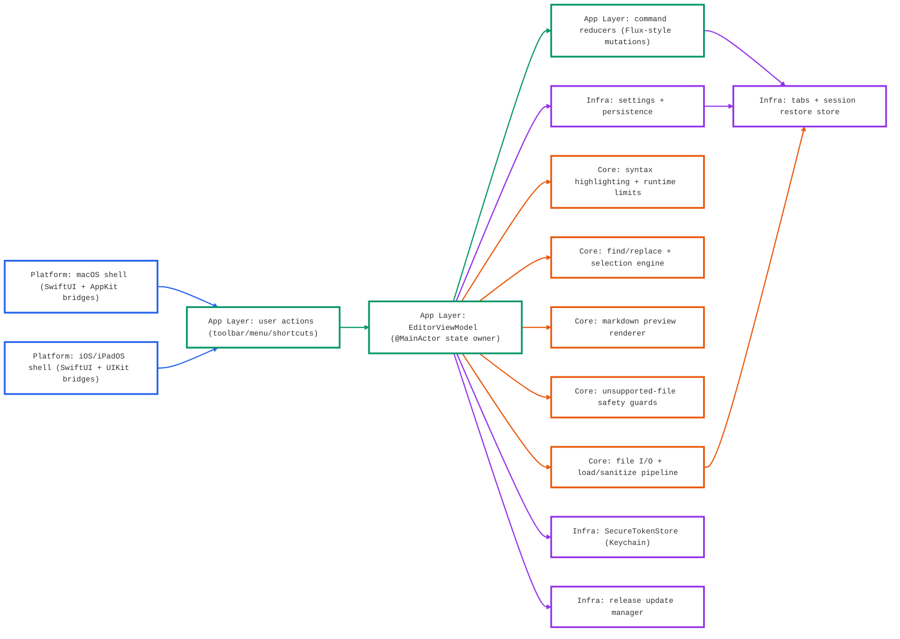
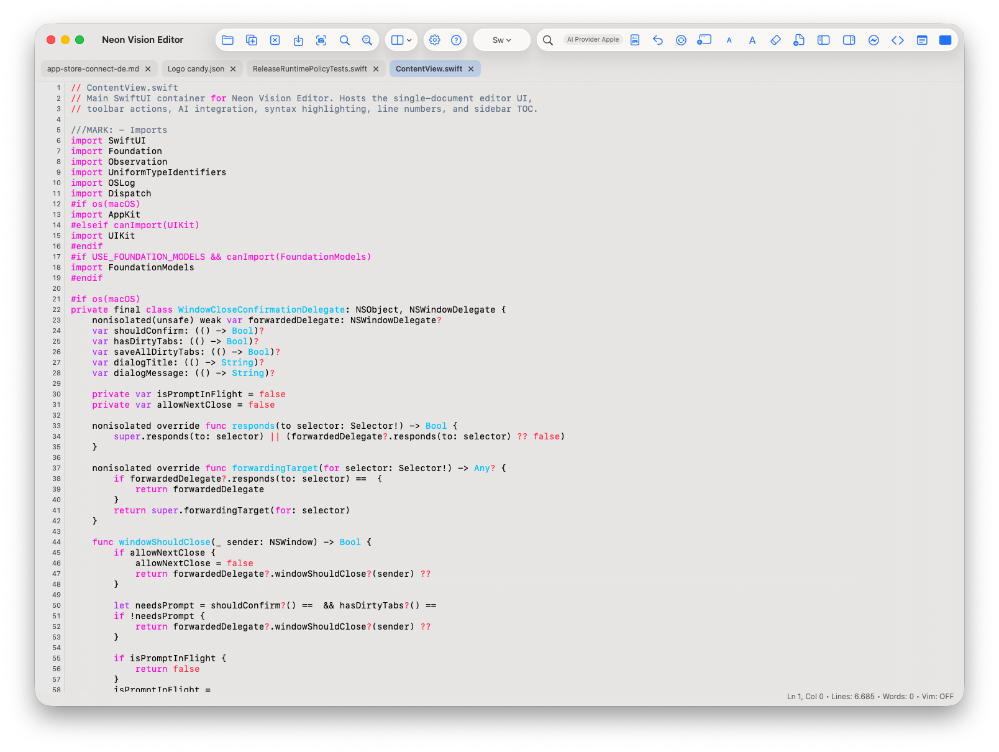
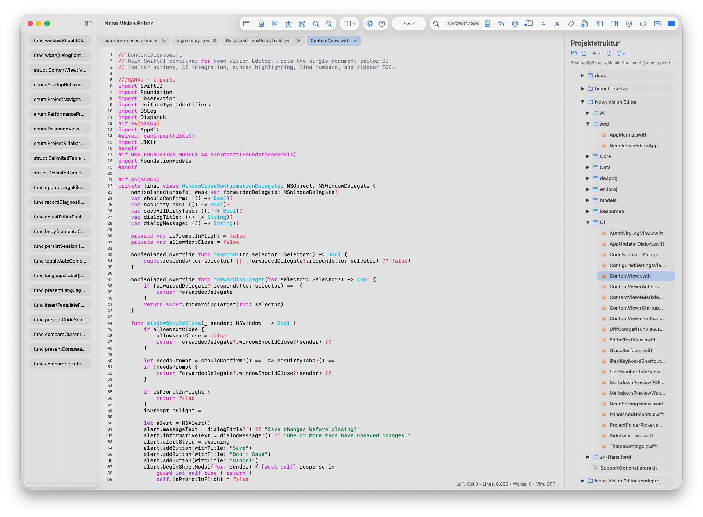

<p align="center"><a href="https://apps-h3p.com"></a><a href="https://buymeacoffee.com/h3pdesign"></a><a href="https://www.patreon.com/h3p"></a><a href="https://www.paypal.com/paypalme/HilthartPedersen"></a></p>

<p align="center">
  <a href="https://github.com/h3pdesign/Neon-Vision-Editor/releases"></a>
  <a href="https://apps.apple.com/de/app/neon-vision-editor/id6758950965"></a>
  <a href="https://github.com/h3pdesign/Neon-Vision-Editor/actions/workflows/release-notarized.yml"></a>
  <a href="https://github.com/h3pdesign/homebrew-tap/actions/workflows/update-cask.yml"></a>
  <a href="https://github.com/h3pdesign/Neon-Vision-Editor/blob/main/SECURITY.md"></a>
  <a href="https://github.com/h3pdesign/Neon-Vision-Editor/commits/main"></a>
  <a href="https://github.com/h3pdesign/Neon-Vision-Editor/blob/main/LICENSE"></a>
</p>

<p align="center">&nbsp;</p>

<div align="center">
  <br>
  
</div>

<p align="center">&nbsp;</p>

<p align="center">
  
</p>

<p align="center">
  <strong>Neon Vision Editor</strong>
</p>

<p align="center">
  <strong><span style="font-size: 1.2em;">A native editor for markdown, notes, and code across macOS, iPhone, and iPad.</span></strong>
</p>

<p align="center">
  Minimal by design. Quick edits, fast file access, no IDE bloat.
</p>

<p align="center">&nbsp;</p>

<p align="center">
  <strong>Download:</strong>
  <a href="https://github.com/h3pdesign/Neon-Vision-Editor/releases">GitHub Releases</a>
  ·
  <a href="https://apps.apple.com/de/app/neon-vision-editor/id6758950965">App Store</a>
  ·
  <a href="https://testflight.apple.com/join/YWB2fGAP">TestFlight</a>
</p>

> Status: **active release**  
> Latest release: **v0.7.7**
> Next release target: **v0.7.9**
> Platform target: **macOS 26 (Tahoe)** compatible with **macOS Sequoia**
> Apple Silicon: tested / Intel: not tested
> Direct GitHub release: **v0.7.7** / iOS App Store approved: **v0.7.7** / iOS App Store review pending: **v0.7.8** / macOS App Store approved: **v0.7.6** / macOS App Store review pending: **v0.7.8**
> Last updated (README): **2026-06-13** for latest release **v0.7.7**

## What's New in v0.7.7 and v0.7.8

### Why Upgrade

- v0.7.8: Fixes iPhone and iPad editor behavior when line wrap is disabled so long lines continue horizontally instead of clipping at the right edge.
- v0.7.8: Makes line wrap the default on fresh iPhone installs while preserving existing user preferences and keeping iPad/macOS defaults unchanged.
- v0.7.8: Restores live cursor position updates in the status bar when editing, moving the caret, or jumping between lines.

### v0.7.8 Highlights

- Enforced horizontal scrollable content width for the iOS/iPadOS native editor in no-wrap mode.
- Added iOS/iPadOS caret position publishing for edit, selection, large-file install, and programmatic navigation paths.
- Aligned macOS cursor column reporting with the existing 1-based status bar display.

### v0.7.7 Context

- v0.7.7: Improves iPad Welcome Tour spacing so the What's New cards, page dots, and navigation buttons sit closer together in compact form sheets.
- v0.7.7: Makes iPad Find & Replace more compact and visually consistent by removing redundant inner panel surfaces and tightening field, option, and action spacing.
- v0.7.7: Cleans up iPhone sidebar density and translucent sheet presentation for table-of-contents and project navigation.

### v0.7.7 Highlights

- Rebalanced Welcome Tour form-sheet geometry on iPad with smaller footer controls, iPad-specific sheet heights, and a lighter bottom fade.
- Tightened iPad Find & Replace sheet width, height, internal padding, picker width, and action button typography.
- Made compact iOS table-of-contents rows narrower with reduced marker, indent, horizontal padding, and row inset values.
- Switched compact iOS table-of-contents and project sidebar sheets to translucent backgrounds with hidden navigation bar backgrounds.

## Start Here

- Jump: [Install](#install) | [Features](#features) | [Contributing](#contributing-quickstart)
- Quick install: [GitHub Releases](https://github.com/h3pdesign/Neon-Vision-Editor/releases), [App Store](https://apps.apple.com/de/app/neon-vision-editor/id6758950965), [TestFlight](https://testflight.apple.com/join/YWB2fGAP)
- Need help quickly: [Troubleshooting](#troubleshooting) | [FAQ](#faq) | [Known Issues](#known-issues)

### Start in 60s (Source Build)

1. `git clone https://github.com/h3pdesign/Neon-Vision-Editor.git`
2. `cd Neon-Vision-Editor`
3. `xcodebuild -project "Neon Vision Editor.xcodeproj" -scheme "Neon Vision Editor" -destination 'platform=macOS,name=My Mac' build`
4. `open "Neon Vision Editor.xcodeproj"` and run, then use `Cmd+P` for Quick Open.

| For | Not For |
|---|---|
| Fast native editing across macOS, iOS, iPadOS | Full IDE workflows with deep refactoring/debugger stacks |
| Markdown writing and script/config edits with highlighting | Teams that require complete Intel Mac validation today |
| Users who want low overhead and quick file access | Users expecting full desktop-IDE parity on iPhone |

## Table of Contents

<p align="center">
  <a href="#start-here">Start Here</a> ·
  <a href="#release-channels">Release Channels</a> ·
  <a href="#core-workflows">Core Workflows</a> ·
  <a href="#download-metrics">Download Metrics</a> ·
  <a href="#project-documentation">Project Documentation</a> ·
  <a href="#features">Features</a>
</p>
<p align="center">
  <a href="#release-spotlight">Release Spotlight</a> ·
  <a href="#platform-matrix">Platform Matrix</a> ·
  <a href="#roadmap-near-term">Roadmap (Near Term)</a> ·
  <a href="#troubleshooting">Troubleshooting</a> ·
  <a href="#faq">FAQ</a> ·
  <a href="#changelog">Changelog</a> ·
  <a href="#contributing-quickstart">Contributing Quickstart</a> ·
  <a href="#support--feedback">Support & Feedback</a>
</p>

## Release Channels

<div align="center">
  <table>
    <thead>
      <tr>
        <th>Channel</th>
        <th>Best for</th>
        <th>Delivery</th>
        <th>Current status</th>
      </tr>
    </thead>
    <tbody>
      <tr>
        <td></td>
        <td>Direct notarized builds and fastest stable updates</td>
        <td><a href="https://github.com/h3pdesign/Neon-Vision-Editor/releases">GitHub Releases</a></td>
        <td>v0.7.8 release docs current; v0.7.7 direct download current</td>
      </tr>
      <tr>
        <td></td>
        <td>Apple-managed install/update flow</td>
        <td><a href="https://apps.apple.com/de/app/neon-vision-editor/id6758950965">App Store</a></td>
        <td>v0.7.6 approved; v0.7.8 in review</td>
      </tr>
      <tr>
        <td></td>
        <td>Early testing of upcoming changes</td>
        <td><a href="https://testflight.apple.com/join/YWB2fGAP">TestFlight</a></td>
        <td>Newest beta availability may vary by review state</td>
      </tr>
    </tbody>
  </table>
</div>

## Download Metrics

<p align="center">
  
  
</p>

<p align="center"><strong>Release Download + Traffic Trend</strong></p>

<p align="center">
  <picture>
    <source media="(prefers-color-scheme: dark)" srcset="docs/images/release-download-trend-dark.svg">
    <source media="(prefers-color-scheme: light)" srcset="docs/images/release-download-trend-light.svg">
    
  </picture>
</p>

<p align="center"><em>Styled line chart shows per-release totals with 14-day traffic counters for clones and views.</em></p>
<p align="center">
  
  
</p>
<p align="center">
  
  
</p>

## Project Documentation

| Document | Purpose |
|---|---|
| [`CHANGELOG.md`](CHANGELOG.md) | Full release history and milestone issue coverage |
| [`CONTRIBUTING.md`](CONTRIBUTING.md) | Local setup, build, and contribution workflow |
| [`PRIVACY.md`](PRIVACY.md) | Privacy guarantees and data-handling policy |
| [`SECURITY.md`](SECURITY.md) | Security policy and responsible disclosure |
| [`release/`](release/) | TestFlight, App Store, and release preflight checklists |

## Who Is This For?

| Best For | Why Neon Vision Editor |
|---|---|
| Quick note takers | Fast native startup and low UI overhead for quick edits |
| Markdown-focused writers | Clean editing with quick preview workflows on Apple devices |
| Developers editing scripts/config files | Syntax highlighting + fast file navigation without full IDE complexity |

## Why This Instead of a Full IDE?

| Advantage | What It Means |
|---|---|
| Faster startup | Lower overhead for short edit sessions |
| Focused surface | Editor-first workflow without project-system bloat |
| Native Apple behavior | Consistent experience on macOS, iOS, and iPadOS |

## Download

Prebuilt binaries are available on [GitHub Releases](https://github.com/h3pdesign/Neon-Vision-Editor/releases).

The direct GitHub release is currently ahead of the App Store version. The App Store version may temporarily lag while updates are in Apple review.

| Channel | Platform | Best For | Download | Release Track | Notes |
|---|---|---|---|---|---|
| **Stable** | macOS | Direct notarized builds and fastest stable updates | [GitHub Releases](https://github.com/h3pdesign/Neon-Vision-Editor/releases) | **v0.7.7** | Current direct download while v0.7.8 App Store review is pending |
| **Store** | iOS / iPadOS | Apple-managed installs and updates | [Neon Vision Editor on the App Store](https://apps.apple.com/de/app/neon-vision-editor/id6758950965) | **v0.7.7** | Current public App Store listing |
| **Store** | macOS | Apple-managed installs and updates | [Neon Vision Editor on the App Store](https://apps.apple.com/de/app/neon-vision-editor/id6758950965) | **v0.7.6** | Current public App Store listing |
| **Store Review** | iOS / iPadOS | Upcoming App Store update | App Store Connect review | **v0.7.8** | In Apple review |
| **Store Review** | macOS | Upcoming App Store update | App Store Connect review | **v0.7.8** | Pending Apple review |
| **Beta** | iOS / iPadOS / macOS | Testing upcoming changes before stable | [TestFlight Invite](https://testflight.apple.com/join/YWB2fGAP) | **v0.7.8** | Early access builds for feedback; availability may vary by review state |

## Install

### Quick install (curl)

Install the latest release directly:

```bash
curl -fsSL https://raw.githubusercontent.com/h3pdesign/Neon-Vision-Editor/main/scripts/install.sh | sh
```

Install without admin password prompts (user-local app folder):

```bash
curl -fsSL https://raw.githubusercontent.com/h3pdesign/Neon-Vision-Editor/main/scripts/install.sh | sh -s -- --appdir "$HOME/Applications"
```

### Homebrew

```bash
brew tap h3pdesign/tap
brew install --cask neon-vision-editor
```

Tap repository: [h3pdesign/homebrew-tap](https://github.com/h3pdesign/homebrew-tap)

If Homebrew asks for an admin password, it is usually because casks install into `/Applications`.
Use this to avoid that:

```bash
brew install --cask --appdir="$HOME/Applications" neon-vision-editor
```

### Command line helper

The macOS app bundles an optional `nve` helper for terminal workflows. Install it only when you want a shell command:

1. Open **Settings > Support**.
2. Copy the **Command Line Helper** install command.
3. Run it in Terminal to link the bundled helper into `$HOME/bin`.

```bash
nve README.md
nve --wait --new-window "Neon Vision Editor/UI/ContentView.swift"
nve --line 42 "Neon Vision Editor/UI/ContentView.swift"
```

Development builds can also link the repository copy:

```bash
ln -sf "$PWD/scripts/nve" "$HOME/.local/bin/nve"
```

Permission model: the helper is optional and user-linked. It calls macOS Launch Services through `/usr/bin/open` and does not read file contents itself. Neon Vision Editor handles the document-open request inside the sandbox with user-selected read/write file access and security-scoped file access. It does not require Full Disk Access, Accessibility access, administrator permission, background services, or telemetry. See [`docs/CommandLineHelper.md`](docs/CommandLineHelper.md).

### Gatekeeper (macOS 26 Tahoe)

If macOS blocks first launch:

1. Open **System Settings**.
2. Go to **Privacy & Security**.
3. In **Security**, find the blocked app message.
4. Click **Open Anyway**.
5. Confirm the dialog.

## Core Workflows

<p align="center">
  
  
  
  
</p>
<p align="center"><sub>Project Sidebar keeps Files, Search, Diff, and Git in one stable surface. Markdown Preview keeps style and export in one toolbar flow. Quick Open keeps file navigation immediate.</sub></p>

## Features

Neon Vision Editor keeps the surface minimal and focuses on fast writing/coding workflows.
Platform-specific availability is tracked in the [Platform Matrix](#platform-matrix) section below.

<p align="center">
  <strong>Editing Core</strong>
</p>
<p align="center">
  
  
  
  
  
  
  
</p>
<p align="center">
  <strong>Navigation & Preview</strong>
</p>
<p align="center">
  
  
  
  
  
  
  
  
</p>
<p align="center">
  <strong>Platform, Output & Customization</strong>
</p>
<p align="center">
  
  
  
  
  
</p>
<p align="center">
  <strong>Safety & Privacy</strong>
</p>
<p align="center">
  
  
  
</p>

### Editing Core

- Fast loading for regular and large text files with tabbed editing.
- Broad Swift 6-ready syntax highlighting (including TeX/LaTeX), inline completion with Tab-to-accept, and regex Find/Replace with Replace All.
- Invisible-character markers on iPhone and iPad render in a lightweight overlay so spaces, tabs, and newlines stay aligned while scrolling.
- Optional Vim workflow support and starter templates for common languages.

### Navigation & Workflow

- Quick Open (`Cmd+P`), project sidebar navigation, and recursive project tree rendering.
- Files, Search, Diff, and Git share larger card-style sidebar tabs with visible grey inactive states and a consistent 450 pt default width.
- The macOS project sidebar includes a Terminal tab that keeps output while switching tabs, offers project/home working-directory choices, and provides clear/restart controls.
- `scripts/nve` opens files from the terminal and supports `--wait`, `--new-window`, and `--line` compatibility flags.
- Find in Files keeps results visible on Mac and iPad when a match opens, while replacement targets start unselected by default.
- Project quick actions (`Expand All` / `Collapse All`), recent project folders, supported-files-only filtering, and default ignored heavy folders (`.git`, `.build`, `node_modules`, `DerivedData`).

### Settings Sync

- Optional iCloud Appearance & Theme Sync keeps appearance, theme colors, custom theme data, formatting toggles, and Markdown preview theme behavior aligned across signed-in devices.
- Sync status includes the latest local iCloud result and timestamp. Documents, API tokens, remote sessions, and editor contents are not synced.
- Native side-by-side diff view for Compare with Disk and Compare Open Tabs workflows, with change navigation.
- Cross-platform `Save As…` and Close All Tabs with confirmation.

### Preview, Platform, and Safety

- Native Markdown preview templates on macOS/iOS/iPadOS plus iPhone bottom-sheet preview.
- `.svg` file support via XML mode and bracket helper on all platforms.
- Markdown and Swift source exports declare their content types correctly on iOS.
- Unsupported-file open/import safety guards and session restore for previously opened project folder.

### Customization & Diagnostics

- Built-in theme collection: Dracula, One Dark Pro, Nord, Tokyo Night, Gruvbox, and Neon Glow.
- Grouped settings, optional StoreKit support flow, and AI Activity Log diagnostics on macOS.

## Release Spotlight

<p align="center">
  
  
  
</p>

- Bugfixes focus on existing editor behavior: iPhone/iPad no-wrap mode now scrolls horizontally instead of clipping long lines.
- Fresh iPhone installs default to line wrap on, while existing line-wrap preferences and iPad/macOS defaults remain unchanged.
- Cursor position reporting now updates when editing, moving the caret, changing lines, and using programmatic line jumps.
- No release behavior changes network access, token storage, sandboxing, or telemetry posture.

## Architecture At A Glance



- `EditorViewModel` is the single UI-facing orchestration point per window/scene.
- Commands mutate editor state predictably; session/tabs persist through store services.
- File access and parsing stay off the main thread; UI state changes stay on the main thread.
- Platform shells stay thin and route interactions into shared app/core services.
- Security-sensitive credentials remain in Keychain (`SecureTokenStore`), not plain prefs.
- Color key in diagram: blue = platform shell, green = app orchestration, orange = core services, purple = infrastructure.

Full architecture reference: [`architecture.md`](architecture.md). The reference tracks the current Swift 6 cross-platform structure, platform guards, editor rendering paths, performance rules, and release verification workflow.

### Architecture principles

- Keep UI mutations on the main thread (`@MainActor`) and heavy work off the UI thread.
- Keep window/scene state isolated to avoid accidental cross-window coupling.
- Keep security defaults strict: tokens in Keychain, no telemetry by default.
- Keep platform wrappers thin and push shared behavior into common services.

## Platform Matrix

Most editor features are shared across macOS, iOS, and iPadOS.

### Shared Across All Platforms

- Fast text editing with syntax highlighting.
- Markdown preview templates (Default, Docs, Article, Compact).
- Project sidebar with supported-files filter and larger card-style Files/Search/Diff/Git tabs.
- Unsupported-file safety alerts.
- SVG (`.svg`) support via XML mode.
- Close All Tabs with confirmation.
- Bracket helper and grouped Settings cards.
- Cross-platform release gate covers macOS, iOS Simulator, and iPad Simulator builds.

### Platform-Specific Differences

| Capability | macOS | iOS | iPadOS | Notes |
|---|---|---|---|---|
| Quick Open<br><sub>`Cmd+P`</sub> |  |  |  | iOS needs a hardware keyboard<br>for shortcut-driven flow. |
| Project Sidebar Tabs<br><sub>v0.6.9</sub> |  |  |  | Files/Search/Diff/Git use larger card targets;<br>regular-width sidebar defaults to 450 pt. |
| Find in Files<br><sub>v0.6.8-v0.6.9</sub> |  |  |  | Mac/iPad results stay open when opening a match;<br>replacement targets start unselected. |
| Invisible Characters<br><sub>v0.6.9</sub> |  |  |  | iPhone/iPad markers draw in a lightweight viewport overlay<br>to stay aligned while scrolling. |
| Line Wrap Default<br><sub>v0.7.8</sub> |  |  |  | Fresh iPhone installs start with wrapping enabled;<br>existing preferences are preserved everywhere. |
| No-Wrap Long Lines<br><sub>v0.7.8</sub> |  |  |  | Long lines continue through horizontal scrolling<br>instead of clipping at the right edge. |
| Cursor Status<br><sub>v0.7.8</sub> |  |  |  | Status bar line/column updates after edits,<br>caret movement, scrolling, and line jumps. |
| Bracket Helper |  |  |  | Same behavior across platforms;<br>only the UI surface differs. |
| Markdown Preview |  |  |  | Interaction adapts to screen size<br>and platform input model. |
| Diff Workflows<br><sub>v0.6.8-v0.6.9</sub> |  |  |  | iPhone uses compact sidebar/sheet presentation;<br>Mac/iPad keep stable sidebar width. |
| Git Sidebar<br><sub>v0.6.7+</sub> |  |  |  | Git uses a macOS-only service because it shells out<br>to the local Git executable. |
| Save As / Text Export<br><sub>v0.6.9</sub> |  |  |  | iOS/iPadOS export declares Markdown and Swift source<br>content types for text saves. |

## Trust & Reliability Signals

- Notarized release pipeline: [release-notarized.yml](https://github.com/h3pdesign/Neon-Vision-Editor/actions/workflows/release-notarized.yml)
- Pre-release verification gate: [pre-release-ci.yml](https://github.com/h3pdesign/Neon-Vision-Editor/actions/workflows/pre-release-ci.yml)
- Security scanning: [CodeQL workflow](https://github.com/h3pdesign/Neon-Vision-Editor/actions/workflows/codeql.yml)
- Homebrew cask sync: [update-cask.yml](https://github.com/h3pdesign/homebrew-tap/actions/workflows/update-cask.yml)

More release integrity details: [Release Integrity](#release-integrity)

## Platform Gallery

- [macOS](#macos)
- [iPad](#ipad)
- [iPhone](#iphone)
- Source image index for docs: [`docs/images/README.md`](docs/images/README.md)
- App Store gallery: [Neon Vision Editor on App Store](https://apps.apple.com/de/app/neon-vision-editor/id6758950965)
- Latest release assets: [GitHub Releases](https://github.com/h3pdesign/Neon-Vision-Editor/releases)

### macOS

<table align="center">
  <tr>
    <td align="center">
      <a href="docs/images/mac-app-screenshot.png">
        
      </a><br>
      <sub>General editing workflow on macOS</sub>
    </td>
    <td align="center">
      <a href="docs/images/mac-editor-frame.png">
        
      </a><br>
      <sub>Wide editing workspace with tabs and status bar context</sub>
    </td>
  </tr>
</table>

### iPad

<table align="center">
  <tr>
    <td align="center">
      <a href="docs/images/ipad-editor-light.png">
        
      </a><br>
      <sub>Project navigation and editing workflow on iPad</sub>
    </td>
    <td align="center">
      <a href="docs/images/ipad-editor-dark.png">
        
      </a><br>
      <sub>Markdown preview workflow in the editor context</sub>
    </td>
  </tr>
</table>

### iPhone

<div align="center">
  <table width="100%" style="max-width: 760px; margin: 0 auto;">
    <tr>
      <td align="center" width="50%">
        <a href="docs/images/iphone-editor-light-frame-updated.png">
          
        </a><br>
        <sub>Editing workflow with syntax highlighting and accessory bar</sub>
      </td>
      <td align="center" width="50%">
        <a href="docs/images/iphone-menu-dark-frame.png">
          
        </a><br>
        <sub>Overflow menu actions in the editor workflow</sub>
      </td>
    </tr>
    <tr>
      <td align="center" width="50%">
        <a href="docs/images/iphone-markdown-preview-dark.png">
          
        </a><br>
        <sub>Markdown preview sheet with template, PDF mode, and export action</sub>
      </td>
      <td align="center" width="50%">
        <a href="docs/images/iphone-themes-light-frame.png">
          
        </a><br>
        <sub>Theme color editing on iPhone</sub>
      </td>
    </tr>
  </table>
</div>

## Release Flow (Completed + Upcoming)

<p align="center">
  <a href="docs/images/neon-vision-release-history-0.1-to-0.5-light.svg">
    <picture>
      <source media="(prefers-color-scheme: dark)" srcset="docs/images/neon-vision-release-history-0.1-to-0.5.svg">
      <source media="(prefers-color-scheme: light)" srcset="docs/images/neon-vision-release-history-0.1-to-0.5-light.svg">
      
    </picture>
  </a>
</p>
<p align="center"><sub>Click to open full-size SVG and zoom. In full view, each card links to release notes or the roadmap hub.</sub></p>

## Roadmap (Near Term)

<p align="center">
  
  
  
</p>

### Now (v0.7.8)

-  focuses on mobile editor correctness: no-wrap horizontal scrolling, iPhone wrap defaults, and live cursor status.
  Tracking: [Release v0.7.8](https://github.com/h3pdesign/Neon-Vision-Editor/releases/tag/v0.7.8)

### Next (v0.7.9)

-  next release planning starts after the v0.7.8 App Store review and Xcode Cloud rollout checks are complete.
  Tracking: [Milestones](https://github.com/h3pdesign/Neon-Vision-Editor/milestones)

### Later (v0.8+)

-  larger workflow expansion after the current cross-platform editor baseline is verified.

## Known Issues

- Open known issues (live filter): [label:known-issue](https://github.com/h3pdesign/Neon-Vision-Editor/issues?q=is%3Aissue%20is%3Aopen%20label%3Aknown-issue)

## Troubleshooting

1. App blocked on first launch: use Gatekeeper steps above in `Privacy & Security`.
2. Markdown preview not visible: ensure you are on macOS or iPadOS (not available on iPhone).
3. Shortcut not working on iOS: connect a hardware keyboard for shortcut-based flows like `Cmd+P`.
4. Sidebar/layout feels cramped on iPad: switch orientation or close side panels before preview.
5. Settings feel off after updates: quit/relaunch app and verify current release version in Settings.

## Configuration

- Theme and appearance: `Settings > Designs`
- Appearance/theme iCloud sync: `Settings > Allgemein/General > Window`
- Editor behavior (font, line height, wrapping, snippets): `Settings > Editor`
- Startup/session behavior: `Settings > Allgemein/General`
- Support and purchase options: `Settings > Mehr/More` (platform-dependent)

## FAQ

- **Does Neon Vision Editor support Intel Macs?**  
  Intel is currently not fully validated. If you can help test, see [Help wanted: Intel Mac test coverage](https://github.com/h3pdesign/Neon-Vision-Editor/issues/41).
- **Can I use it offline?**  
  Yes for core editing; network is only needed for optional external services (for example selected AI providers).
- **Do I need AI enabled to use the editor?**  
  No. Core editing, navigation, and preview features work without AI.
- **Where are tokens stored?**  
  In Keychain via `SecureTokenStore`, not in `UserDefaults`.

## Keyboard Shortcuts

All shortcuts use `Cmd` (`⌘`). iPad/iOS require a hardware keyboard.

 

<table align="center" width="100%">
  <tr>
    <td width="50%" valign="top">
      <p></p>
      <table width="100%">
        <tr><th align="left" width="32%">Shortcut</th><th align="left" width="43%">Action</th><th align="left" width="25%">Platforms</th></tr>
        <tr><td><code>Cmd+N</code></td><td>New Window</td><td></td></tr>
        <tr><td><code>Cmd+T</code></td><td>New Tab</td><td></td></tr>
        <tr><td><code>Cmd+O</code></td><td>Open File</td><td></td></tr>
        <tr><td><code>Cmd+Shift+O</code></td><td>Open Folder</td><td></td></tr>
        <tr><td><code>Cmd+S</code></td><td>Save</td><td></td></tr>
        <tr><td><code>Cmd+Shift+S</code></td><td>Save As...</td><td></td></tr>
        <tr><td><code>Cmd+W</code></td><td>Close Tab</td><td></td></tr>
      </table>
    </td>
    <td width="50%" valign="top">
      <p></p>
      <table width="100%">
        <tr><th align="left" width="32%">Shortcut</th><th align="left" width="43%">Action</th><th align="left" width="25%">Platforms</th></tr>
        <tr><td><code>Cmd+X</code></td><td>Cut</td><td></td></tr>
        <tr><td><code>Cmd+C</code></td><td>Copy</td><td></td></tr>
        <tr><td><code>Cmd+V</code></td><td>Paste</td><td></td></tr>
        <tr><td><code>Cmd+A</code></td><td>Select All</td><td></td></tr>
        <tr><td><code>Cmd+Z</code></td><td>Undo</td><td></td></tr>
        <tr><td><code>Cmd+Shift+Z</code></td><td>Redo</td><td></td></tr>
        <tr><td><code>Cmd+D</code></td><td>Add Next Match</td><td></td></tr>
      </table>
    </td>
  </tr>
  <tr>
    <td width="50%" valign="top">
      <p></p>
      <table width="100%">
        <tr><th align="left" width="32%">Shortcut</th><th align="left" width="43%">Action</th><th align="left" width="25%">Platforms</th></tr>
        <tr><td><code>Cmd+Option+S</code></td><td>Toggle Sidebar</td><td></td></tr>
        <tr><td><code>Cmd+Shift+D</code></td><td>Brain Dump Mode</td><td></td></tr>
      </table>
    </td>
    <td width="50%" valign="top">
      <p></p>
      <table width="100%">
        <tr><th align="left" width="32%">Shortcut</th><th align="left" width="43%">Action</th><th align="left" width="25%">Platforms</th></tr>
        <tr><td><code>Cmd+F</code></td><td>Find &amp; Replace</td><td></td></tr>
        <tr><td><code>Cmd+G</code></td><td>Find Next</td><td></td></tr>
        <tr><td><code>Cmd+Shift+F</code></td><td>Find in Files</td><td></td></tr>
      </table>
    </td>
  </tr>
  <tr>
    <td width="50%" valign="top">
      <p></p>
      <table width="100%">
        <tr><th align="left" width="32%">Shortcut</th><th align="left" width="43%">Action</th><th align="left" width="25%">Platforms</th></tr>
        <tr><td><code>Cmd+P</code></td><td>Quick Open</td><td></td></tr>
        <tr><td><code>Cmd+D</code></td><td>Add next<br>match</td><td></td></tr>
        <tr><td><code>Cmd+Shift+V</code></td><td>Toggle Vim<br>Mode</td><td></td></tr>
      </table>
    </td>
    <td width="50%" valign="top">
      <p> </p>
      <table width="100%">
        <tr><th align="left" width="32%">Shortcut</th><th align="left" width="43%">Action</th><th align="left" width="25%">Platforms</th></tr>
        <tr><td><code>Cmd+Shift+G</code></td><td>Suggest Code</td><td></td></tr>
        <tr><td><code>Cmd+Shift+L</code></td><td>AI Activity Log</td><td></td></tr>
        <tr><td><code>Cmd+Shift+U</code></td><td>Inspect whitespace<br>at caret</td><td></td></tr>
      </table>
    </td>
  </tr>
</table>

## Changelog

Latest stable: **v0.7.8** (2026-06-11)

### Recent Releases (At a glance)

| Version | Date | Highlights | Fixes | Breaking changes | Migration |
|---|---|---|---|---|---|
| [`v0.7.8`](https://github.com/h3pdesign/Neon-Vision-Editor/releases/tag/v0.7.8) | 2026-06-11 | Enforced horizontal scrollable content width for the iOS/iPadOS native editor in no-wrap mode; iOS/iPadOS caret position publishing for edit, selection, large-file install, and programmatic navigation paths; Aligned macOS cursor column reporting with the existing 1-based status bar display | no-wrap text being cut off on iPhone and iPad instead of allowing horizontal scrolling; the cursor status staying at `Ln 1, Col 1` on iPhone after caret movement; programmatic line jumps not always refreshing the cursor status immediately | None noted | None. Existing line wrap preferences remain respected. |
| [`v0.7.7`](https://github.com/h3pdesign/Neon-Vision-Editor/releases/tag/v0.7.7) | 2026-06-08 | Rebalanced Welcome Tour form-sheet geometry on iPad with smaller footer controls, iPad-specific sheet heights, and a lighter bottom fade; Tightened iPad Find & Replace sheet width, height, internal padding, picker width, and action button typography; Made compact iOS table-of-contents rows narrower with reduced marker, indent, horizontal padding, and row inset values; Switched compact iOS table-of-contents and project sidebar sheets to translucent backgrounds with hidden navigation bar backgrounds | excessive empty space between Welcome Tour cards and footer buttons on iPad form sheets; iPad Find & Replace showing stacked inner and outer panel backgrounds instead of a single translucent sheet surface; iPad Find & Replace wasting space around fields, toggles, scope selection, and action buttons | None noted | None. Existing sidebar, search, and Welcome Tour state is reused. |
| [`v0.7.6`](https://github.com/h3pdesign/Neon-Vision-Editor/releases/tag/v0.7.6) | 2026-06-07 | configurable status bar items for cursor position, line count, word count, encoding, line endings, indentation, selection size, file size, Git branch/changes, and Markdown preview theme; Reworked the macOS Themes settings tab into balanced cards with integrated theme preview, theme selection, theme colors, formatting, and Markdown preview controls; Markdown preview theme audit coverage and compact clipping fixtures for iPhone-sized layouts; localization audit coverage for settings/status bar strings | iPhone Markdown preview theme content and control cards being clipped in compact layouts; macOS editor flicker and disappearing text while scrolling Swift code with bold keywords, current-line highlighting, matching-bracket highlighting, and line wrap combinations; macOS Settings layout overflow by enabling resize behavior and using scroll-safe content when the user reduces the window size | None noted | None. Existing editor, status bar, theme, and Markdown preview preferences are reused. |

- Full release history: [`CHANGELOG.md`](CHANGELOG.md)
- Latest release: **v0.7.7**
- Compare recent changes: [v0.7.7...v0.7.8](https://github.com/h3pdesign/Neon-Vision-Editor/compare/v0.7.7...v0.7.8)

## Known Limitations

- Intel Mac support is not fully validated yet.
- Vim mode is intentionally lightweight, not full Vim emulation.
- iPhone and iPad workflows still offer a smaller feature set than macOS.

## Privacy & Security

- Privacy policy: [`PRIVACY.md`](PRIVACY.md).
- API keys are stored in Keychain (`SecureTokenStore`), not `UserDefaults`.
- Network traffic uses HTTPS.
- No telemetry.
- External AI requests only occur when code completion is enabled and a provider is selected.
- Security policy and reporting details: [`SECURITY.md`](SECURITY.md).
- New repository commits are SSH-signed; older historical commits may still predate commit signing.
- Local SSH-signature verification in this clone can use the repo-scoped `.git_allowed_signers` file.

## Release Integrity

- Tag: `v0.7.8`
- Tagged commit: release tag target
- Verify local tag target:

```bash
git rev-parse --verify v0.7.8
```

- Verify downloaded artifact checksum locally:

```bash
shasum -a 256 <downloaded-file>
```

- Verify local SSH commit signatures in this clone:

```bash
git config --local gpg.ssh.allowedSignersFile .git_allowed_signers
git log --show-signature -1
```

## Release Policy

- `Stable`: tagged GitHub releases intended for daily use.
- `Beta`: TestFlight builds may include in-progress UX and platform polish.
- Cadence: fixes/polish can ship between minor tags, with summary notes mirrored in README and `CHANGELOG.md`.

## Requirements

### App Runtime

- macOS 26 (Tahoe)
- Apple Silicon recommended

### Build Requirements

- Xcode with the macOS 26 toolchain
- iOS and iPadOS simulator runtimes installed in Xcode for cross-platform verification

## Build from source

If you already completed the [Start in 60s (Source Build)](#start-in-60s-source-build), you can open and run directly from Xcode.

```bash
git clone https://github.com/h3pdesign/Neon-Vision-Editor.git
cd Neon-Vision-Editor
open "Neon Vision Editor.xcodeproj"
```

## Contributing Quickstart

Contributor guide: [`CONTRIBUTING.md`](CONTRIBUTING.md)

1. Fork the repo and create a focused branch.
2. Implement the smallest safe diff for your change.
3. Build on macOS first.
4. Run cross-platform verification script.
5. Open a PR with screenshots for UI changes and a short risk note.
6. Link to related issue/milestone and call out user-visible impact.

```bash
git clone https://github.com/h3pdesign/Neon-Vision-Editor.git
cd Neon-Vision-Editor
xcodebuild -project "Neon Vision Editor.xcodeproj" -scheme "Neon Vision Editor" -destination 'platform=macOS,name=My Mac' build
```

Lock-safe cross-platform verification (sequential macOS + iOS Simulator + iPad Simulator):

```bash
scripts/ci/build_platform_matrix.sh
```

## Support & Feedback

### Feedback Pulse

Share what works well and what should improve for both the app and the README.

<p align="center">
  <a href="https://github.com/h3pdesign/Neon-Vision-Editor/issues?q=is%3Aissue%20is%3Aopen%20%22%5BPositive%20Feedback%5D%22%20in%3Atitle">
    
  </a>
  &nbsp;
  <a href="https://github.com/h3pdesign/Neon-Vision-Editor/issues?q=is%3Aissue%20is%3Aopen%20%22%5BNegative%20Feedback%5D%22%20in%3Atitle">
    
  </a>
</p>
<p align="center">
  <a href="https://github.com/h3pdesign/Neon-Vision-Editor/issues/new?template=feature_request.yml&title=%5BPositive%20Feedback%5D%20App%2FREADME%3A%20">Share positive feedback</a>
  &nbsp;·&nbsp;
  <a href="https://github.com/h3pdesign/Neon-Vision-Editor/issues/new?template=bug_report.yml&title=%5BNegative%20Feedback%5D%20App%2FREADME%3A%20">Share negative feedback</a>
</p>

- Questions and ideas: [GitHub Discussions](https://github.com/h3pdesign/Neon-Vision-Editor/discussions)
- Project board (Now / Next / Later): [Neon Vision Editor Roadmap](https://github.com/users/h3pdesign/projects/2)
- Known issues: [Known Issues Hub #50](https://github.com/h3pdesign/Neon-Vision-Editor/issues/50)
- Contributor entry points: [good first issue](https://github.com/h3pdesign/Neon-Vision-Editor/issues?q=is%3Aissue%20is%3Aopen%20label%3A%22good%20first%20issue%22) | [help wanted](https://github.com/h3pdesign/Neon-Vision-Editor/issues?q=is%3Aissue%20is%3Aopen%20label%3A%22help%20wanted%22)
- Issue filters: [enhancement](https://github.com/h3pdesign/Neon-Vision-Editor/issues?q=is%3Aissue%20is%3Aopen%20label%3Aenhancement) | [known-issue](https://github.com/h3pdesign/Neon-Vision-Editor/issues?q=is%3Aissue%20is%3Aopen%20label%3Aknown-issue) | [regression](https://github.com/h3pdesign/Neon-Vision-Editor/issues?q=is%3Aissue%20is%3Aopen%20label%3Aregression)

### Support Neon Vision Editor

Keep it free, sustainable, and improving.

<p align="center">
  <a href="https://buymeacoffee.com/h3pdesign">
    
  </a>
  <a href="https://www.patreon.com/h3p">
    
  </a>
  <a href="https://www.paypal.com/paypalme/HilthartPedersen">
    
  </a>
</p>

- Neon Vision Editor will always stay free to use.
- No subscriptions and no paywalls.
- Keeping the app alive still has real costs: Apple Developer Program fee, maintenance, updates, and long-term support.
- Optional Support Tip (Consumable): **$4.99** and can be purchased multiple times.
- Your support helps cover Apple developer fees, bug fixes and updates, future improvements and features, and long-term support.
- Thank you for helping keep Neon Vision Editor free for everyone.

- In-app support tip: `Settings > Mehr/More` (platform-dependent)
- External support: [Buy Me a Coffee](https://buymeacoffee.com/h3pdesign)
- External support: [Patreon](https://www.patreon.com/h3p)
- h3p apps portal for docs, setup guides, and release workflows: [>h3p apps](https://apps-h3p.com)
- External support: [PayPal](https://www.paypal.com/paypalme/HilthartPedersen)

### Creator Sites

<p align="center">
  <a href="https://h3p.me/home">
    
  </a>
  <a href="https://apps-h3p.com">
    
  </a>
</p>

- Discussions categories: [Ideas](https://github.com/h3pdesign/Neon-Vision-Editor/discussions/categories/ideas) | [Q&A](https://github.com/h3pdesign/Neon-Vision-Editor/discussions/categories/q-a) | [Showcase](https://github.com/h3pdesign/Neon-Vision-Editor/discussions/categories/show-and-tell)

## Git hooks

To auto-increment Xcode `CURRENT_PROJECT_VERSION` on every commit:

```bash
scripts/install_git_hooks.sh
```

## Changed License

Neon Vision Editor is licensed under the Apache License, Version 2.0.
See [`LICENSE`](LICENSE).

The project moved to Apache-2.0 because it keeps the same permissive open-source
model while adding an explicit patent grant and patent-termination protection for
contributors and downstream users. This better matches a developer tool that may
receive contributions, integrations, and commercial redistribution over time.
