<p align="center"><a href="https://apps-h3p.com"></a><a href="https://buymeacoffee.com/h3pdesign"></a><a href="https://www.patreon.com/h3p"></a><a href="https://www.paypal.com/paypalme/HilthartPedersen"></a></p>

<p align="center">
  <a href="https://github.com/h3pdesign/Neon-Vision-Editor/releases"></a>
  <a href="https://apps.apple.com/de/app/neon-vision-editor/id6758950965"></a>
  <a href="https://github.com/h3pdesign/Neon-Vision-Editor/actions/workflows/release-notarized.yml"></a>
  <a href="https://github.com/h3pdesign/homebrew-tap/actions/workflows/update-cask.yml"></a>
  <a href="https://github.com/h3pdesign/Neon-Vision-Editor/blob/main/SECURITY.md"></a>
  <a href="https://github.com/h3pdesign/Neon-Vision-Editor/commits/main"></a>
  <a href="https://github.com/h3pdesign/Neon-Vision-Editor/blob/main/LICENSE"></a>
</p>

<p align="center">&nbsp;</p>

<div align="center">
  <br>
  
</div>

<p align="center">&nbsp;</p>

<p align="center">
  
</p>

<p align="center">
  <strong>Neon Vision Editor</strong>
</p>

<p align="center">
  <strong><span style="font-size: 1.2em;">A native editor for markdown, notes, and code across macOS, iPhone, and iPad.</span></strong>
</p>

<p align="center">
  Minimal by design. Quick edits, fast file access, no IDE bloat.
</p>

<p align="center">&nbsp;</p>

<p align="center">
  <strong>Download:</strong>
  <a href="https://github.com/h3pdesign/Neon-Vision-Editor/releases">GitHub Releases</a>
  ·
  <a href="https://apps.apple.com/de/app/neon-vision-editor/id6758950965">App Store</a>
  ·
  <a href="https://testflight.apple.com/join/YWB2fGAP">TestFlight</a>
</p>

<p align="center">
  <a href="docs/images/readme-hero-macos-light.png">
    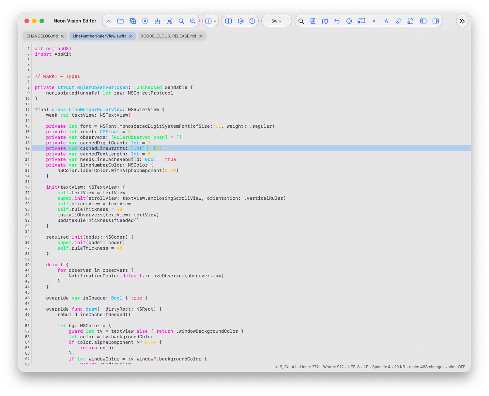
  </a>
</p>

> Status: **active release**  
> Latest release: **v0.9.4**
> Next release target: **v0.9.5**
> Platform target: **macOS 26 (Tahoe)** compatible with **macOS Sequoia**
> Apple Silicon: tested / Intel: not tested
> Direct GitHub release: **v0.9.4** / App Store and TestFlight availability varies by platform and review status
> Last updated (README): **2026-07-22** for latest release **v0.9.4**

## What's New in v0.9.3 and v0.9.4

### Why Upgrade

<p align="center">
  
</p>

- v0.9.4: Adds a lightweight shared-file sync experience: when iCloud Drive, a network folder, or another app updates an open file, clean tabs refresh automatically while unsaved edits remain protected by the existing review flow.
- v0.9.4: Keeps tab switching and minimap scrolling responsive, and automatically reveals a newly opened or selected tab when the tab strip is crowded.
- v0.9.4: Separates Sparkle from App Store builds and strengthens the GitHub release path for reliable package resolution and Homebrew Cask delivery.

### v0.9.4 Highlights

- Open documents now use event-driven file presentation with coalesced metadata checks instead of selection-time polling, so changes delivered from another device through iCloud Drive or network storage can appear without reopening the tab.
- External sync progress, completion, and review-needed states appear in the editor status area for one or multiple tabs; the shared storage remains the transport and Neon Vision Editor supplies open-tab refresh and conflict protection.
- GitHub-hosted releases can prepare the Homebrew Cask update branch with a GitHub App token and provide a direct pull-request link in the workflow summary.

### v0.9.3 Context

- v0.9.3: Fixes macOS wrapped source text being clipped at the preview boundary after tab, sidebar, or preview changes.
- v0.9.3: Restores native AppKit source-pane reflow without horizontal movement while Line Wrap is enabled.
- v0.9.3: Removes updater code paths that produced unreachable-code diagnostics in current Xcode builds.

### v0.9.3 Highlights

- Wrapped macOS editors now let TextKit follow the width allocated by the SwiftUI split layout.

## Start Here

- Jump: [Install](#install) | [Features](#features) | [Contributing](#contributing-quickstart)
- Quick install: [GitHub Releases](https://github.com/h3pdesign/Neon-Vision-Editor/releases), [App Store](https://apps.apple.com/de/app/neon-vision-editor/id6758950965), [TestFlight](https://testflight.apple.com/join/YWB2fGAP)
- Need help quickly: [Troubleshooting](#troubleshooting) | [FAQ](#faq) | [Known Issues](#known-issues)

### Start in 60s (Source Build)

1. `git clone https://github.com/h3pdesign/Neon-Vision-Editor.git`
2. `cd Neon-Vision-Editor`
3. `xcodebuild -project "Neon Vision Editor.xcodeproj" -scheme "Neon Vision Editor" -destination 'platform=macOS,name=My Mac' build`
4. `open "Neon Vision Editor.xcodeproj"` and run, then use `Cmd+P` for Quick Open.

| For | Not For |
|---|---|
| Fast native editing across macOS, iOS, iPadOS | Full IDE workflows with deep refactoring/debugger stacks |
| Markdown writing and script/config edits with highlighting | Teams that require complete Intel Mac validation today |
| Users who want low overhead and quick file access | Users expecting full desktop-IDE parity on iPhone |

## Table of Contents

<p align="center">
  <a href="#start-here">Start Here</a> ·
  <a href="#release-channels">Release Channels</a> ·
  <a href="#core-workflows">Core Workflows</a> ·
  <a href="#download-metrics">Download Metrics</a> ·
  <a href="#project-documentation">Project Documentation</a> ·
  <a href="#features">Features</a>
</p>
<p align="center">
  <a href="#release-spotlight">Release Spotlight</a> ·
  <a href="#platform-matrix">Platform Matrix</a> ·
  <a href="#roadmap-near-term">Roadmap (Near Term)</a> ·
  <a href="#troubleshooting">Troubleshooting</a> ·
  <a href="#faq">FAQ</a> ·
  <a href="#changelog">Changelog</a> ·
  <a href="#contributing-quickstart">Contributing Quickstart</a> ·
  <a href="#support--feedback">Support & Feedback</a>
</p>

## Release Channels

<div align="center">
  <table>
    <thead>
      <tr>
        <th>Channel</th>
        <th>Best for</th>
        <th>Delivery</th>
        <th>Current status</th>
      </tr>
    </thead>
    <tbody>
      <tr>
        <td></td>
        <td>Direct notarized builds and fastest stable updates</td>
        <td><a href="https://github.com/h3pdesign/Neon-Vision-Editor/releases">GitHub Releases</a></td>
        <td>v0.9.4 release docs current; v0.9.4 direct download current</td>
      </tr>
      <tr>
        <td></td>
        <td>Apple-managed install/update flow</td>
        <td><a href="https://apps.apple.com/de/app/neon-vision-editor/id6758950965">App Store</a></td>
        <td>Check the platform listing for current availability</td>
      </tr>
      <tr>
        <td></td>
        <td>Early testing of upcoming changes</td>
        <td><a href="https://testflight.apple.com/join/YWB2fGAP">TestFlight</a></td>
        <td>Newest beta availability may vary by review state</td>
      </tr>
    </tbody>
  </table>
</div>

## Download Metrics

<p align="center">
  
  
</p>

<p align="center"><strong>Release Download + Traffic Trend</strong></p>

<p align="center">
  <picture>
    <source media="(prefers-color-scheme: dark)" srcset="docs/images/release-download-trend-dark.svg">
    <source media="(prefers-color-scheme: light)" srcset="docs/images/release-download-trend-light.svg">
    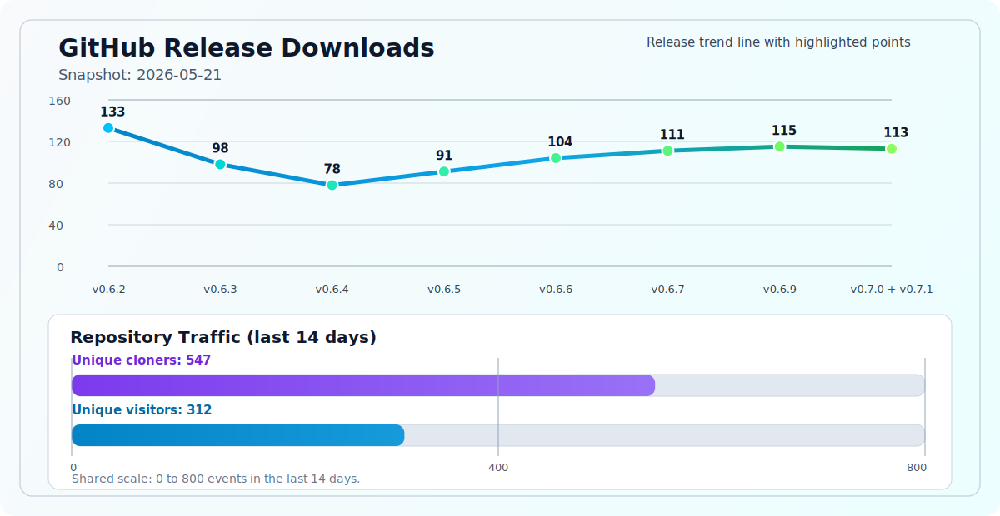
  </picture>
</p>

<p align="center"><em>Styled line chart shows per-release totals with 14-day traffic counters for clones and views.</em></p>
<p align="center">
  
  
</p>
<p align="center">
  
  
</p>

## Project Documentation

| Document | Purpose |
|---|---|
| [`CHANGELOG.md`](CHANGELOG.md) | Full release history and milestone issue coverage |
| [`CONTRIBUTING.md`](CONTRIBUTING.md) | Local setup, build, and contribution workflow |
| [`PRIVACY.md`](PRIVACY.md) | Privacy guarantees and data-handling policy |
| [`SECURITY.md`](SECURITY.md) | Security policy and responsible disclosure |
| [`release/`](release/) | TestFlight, App Store, and release preflight checklists |

## Who Is This For?

| Best For | Why Neon Vision Editor |
|---|---|
| Quick note takers | Fast native startup and low UI overhead for quick edits |
| Markdown-focused writers | Clean editing with quick preview workflows on Apple devices |
| Developers editing scripts/config files | Syntax highlighting + fast file navigation without full IDE complexity |

## Why This Instead of a Full IDE?

| Advantage | What It Means |
|---|---|
| Faster startup | Lower overhead for short edit sessions |
| Focused surface | Editor-first workflow without project-system bloat |
| Native Apple behavior | Consistent experience on macOS, iOS, and iPadOS |

## Download

Prebuilt binaries are available on [GitHub Releases](https://github.com/h3pdesign/Neon-Vision-Editor/releases).

The direct GitHub release is currently ahead of the App Store version. The App Store version may temporarily lag while updates are in Apple review.

| Channel | Platform | Best For | Download | Release Track | Notes |
|---|---|---|---|---|---|
| **Stable** | macOS | Direct notarized builds and fastest stable updates | [GitHub Releases](https://github.com/h3pdesign/Neon-Vision-Editor/releases) | **v0.9.4** | Current direct download |
| **Store** | iOS / iPadOS | Apple-managed installs and updates | [Neon Vision Editor on the App Store](https://apps.apple.com/de/app/neon-vision-editor/id6758950965) | **v0.7.8** | Current public App Store listing |
| **Store** | macOS | Apple-managed installs and updates | [Neon Vision Editor on the App Store](https://apps.apple.com/de/app/neon-vision-editor/id6758950965) | **v0.8.6** | Current public App Store listing |
| **Store** | visionOS | Apple-managed installs and updates | [Neon Vision Editor on the App Store](https://apps.apple.com/de/app/neon-vision-editor/id6758950965) | **v0.8.8** | Current public App Store listing |
| **Store Review** | iOS / iPadOS | Upcoming App Store update | App Store Connect review | **v0.9.4** | In Apple review |
| **Beta** | iOS / iPadOS / macOS | Testing upcoming changes before stable | [TestFlight Invite](https://testflight.apple.com/join/YWB2fGAP) | **v0.9.4** | Early access builds for feedback; availability may vary by review state |

## Install

### Quick install (curl)

Install the latest release directly:

```bash
curl -fsSL https://raw.githubusercontent.com/h3pdesign/Neon-Vision-Editor/main/scripts/install.sh | sh
```

Install without admin password prompts (user-local app folder):

```bash
curl -fsSL https://raw.githubusercontent.com/h3pdesign/Neon-Vision-Editor/main/scripts/install.sh | sh -s -- --appdir "$HOME/Applications"
```

### Homebrew

Homebrew detects Neon Vision Editor as a cask, so either command works:

```bash
brew install neon-vision-editor
```

Or use the explicit cask form:

```bash
brew install --cask neon-vision-editor
```

Cask source: [Homebrew/homebrew-cask](https://github.com/Homebrew/homebrew-cask/blob/HEAD/Casks/n/neon-vision-editor.rb)

If Homebrew asks for an admin password, it is usually because casks install into `/Applications`.
Use this to avoid that:

```bash
brew install --cask --appdir="$HOME/Applications" neon-vision-editor
```

### GitHub macOS command line helper

The direct macOS build from GitHub bundles an optional `nve` helper for terminal workflows. It is not included in the Mac App Store build. Install it only when you want a shell command:

1. Open **Settings > Support**.
2. Copy the **Command Line Helper** install command.
3. Run it in Terminal to link the bundled helper into `$HOME/bin`.

```bash
nve README.md
nve --wait --new-window "Neon Vision Editor/UI/ContentView.swift"
nve --line 42 "Neon Vision Editor/UI/ContentView.swift" # validates the line flag; cursor placement is not yet supported
```

Development builds can also link the repository copy:

```bash
mkdir -p "$HOME/bin"
ln -sf "$PWD/scripts/nve" "$HOME/bin/nve"
```

Permission model: the helper is optional and user-linked. It calls macOS Launch Services through `/usr/bin/open` and does not read file contents itself. Neon Vision Editor handles the document-open request inside the sandbox with user-selected read/write file access and security-scoped file access. It does not require Full Disk Access, Accessibility access, administrator permission, background services, or telemetry. See [`docs/CommandLineHelper.md`](docs/CommandLineHelper.md).

## Core Workflows

<p align="center">
  
  
  
  
  
  
</p>
<p align="center"><sub>Project Sidebar keeps Files, Search, Git, and Terminal in one stable surface. Remote Sessions stay opt-in and user-triggered. Markdown formatting, preview, and export stay in one contextual flow.</sub></p>

## Features

Neon Vision Editor keeps the surface minimal and focuses on fast writing/coding workflows.
Platform-specific availability is tracked in the [Platform Matrix](#platform-matrix) section below.

<p align="center">
  <strong>Editing Core</strong>
</p>
<p align="center">
  
  
  
  
  
  
  
  
</p>
<p align="center">
  <strong>Navigation & Preview</strong>
</p>
<p align="center">
  
  
  
  
  
  
  
  
  
</p>
<p align="center">
  <strong>Platform, Output & Customization</strong>
</p>
<p align="center">
  
  
  
  
  
  
</p>
<p align="center">
  <strong>Safety & Privacy</strong>
</p>
<p align="center">
  
  
  
</p>

### Editing Core

- Fast loading for regular and large text files with tabbed editing.
- Files below 100 MB remain editable. The app starts a lightweight file-loading profile at 2 MB and can enable Large File Mode earlier for documents with high character or line counts.
- Large File Mode favors responsive opening, scrolling, and typing: full-document syntax analysis, minimap, preview, symbols, word count, and diff can be deferred or temporarily unavailable. The active mode and file size are shown in the editor status UI.
- Choose **Standard** for normal processing, **Responsive** for chunked installation and deferred work, or **Plain Text** when an unstyled editor is the safest choice for an unusually large document.
- Files at **100 MB or more** open as a clearly marked, read-only **Partial Open**. Neon reads only the first 4 MB, ending at a line boundary where possible; it never loads the full file into the editor buffer or permits saving the partial content over the source.
- Broad Swift 6-ready syntax highlighting (including TeX/LaTeX), inline completion with Tab-to-accept, and regex Find/Replace with Replace All.
- Optional Code Minimap gives a compact file overview, click-to-jump navigation, and a draggable viewport marker without changing the default editor surface.
- Invisible-character markers on iPhone and iPad render in a lightweight overlay so spaces, tabs, and newlines stay aligned while scrolling.
- Trackpad pinch on macOS and touch pinch on iPhone, iPad, and Apple Vision Pro adjust editor font size while retaining the normal font controls.
- Optional Vim workflow support and starter templates for common languages.

### Navigation & Workflow

- Quick Open (`Cmd+P`), project sidebar navigation, and recursive project tree rendering.
- The macOS Project Sidebar uses a single Files/Search/Git/Terminal glass rail with clearer active and inactive states, visible Git change counts, compact file-status rows, and a 450 pt default width.
- The macOS project sidebar includes a Terminal tab that keeps output while switching tabs, offers project/home working-directory choices, and provides clear/restart controls.
- `scripts/nve` opens files from the terminal and supports `--wait`, `--new-window`, and `--line` compatibility flags.
- Find in Files keeps results visible on Mac and iPad when a match opens, while replacement targets start unselected by default.
- Remote Sessions are opt-in: macOS owns SSH-key login and can publish an attach code so iPhone, iPad, and Apple Vision Pro can browse, open, edit, and explicitly save supported remote text files through the Mac-hosted broker.
- Project quick actions (`Expand All` / `Collapse All`), recent project folders, supported-files-only filtering, and default ignored heavy folders (`.git`, `.build`, `node_modules`, `DerivedData`).

### Settings & Sync

- Shared files stay synchronized in already-open tabs when iCloud Drive, a network folder, or another app delivers changes. Clean tabs refresh automatically; dirty tabs require **Keep Local**, **Reload from Disk**, or **Compare**, and the status area reports progress and files needing review.
- iCloud Drive or the network folder provides document transport; Neon Vision Editor observes, refreshes, and protects conflicts without uploading editor contents to its own service.
- Optional iCloud Appearance & Theme Sync keeps appearance, theme colors, custom theme data, formatting toggles, and Markdown preview theme behavior aligned across signed-in devices.
- Appearance-sync status includes the latest local iCloud result and timestamp. That settings service does not sync documents, API tokens, remote sessions, or editor contents.

### Compare & Save

- Native side-by-side diff view for Compare with Disk and Compare Open Tabs workflows, with change navigation.
- Cross-platform `Save As…` and Close All Tabs with confirmation.
- Remote saves are explicit and conflict-aware; if the remote revision changes, the app offers a compare-before-reload path instead of overwriting silently.

### Preview, Platform, and Safety

- Contextual Markdown formatting provides inline actions, five heading levels, lists, quote/code tools, and structural insertion; iPhone presents the full set from a compact `Aa` control.
- One opt-in toolbar control opens and closes Markdown, HTML, and SVG previews. macOS plus regular-width iPad and visionOS layouts use inline panes; iPhone uses a preview sheet.
- Markdown previews provide 23 templates and GitHub Flavored Markdown support on macOS, iPhone, and iPad. Apple Vision Pro uses dedicated System Glass, Paper, Slate, and Ink reader surfaces.
- `.svg` files support XML editing, bracket help, and rendered SVG Preview on all platforms.
- Markdown and Swift source exports declare their content types correctly on iOS and iPadOS.
- Unsupported-file open/import safety guards, remote text-file limits, and session restore for previously opened project folder.

### Customization & Diagnostics

- Built-in editor palettes include Neon Glow, Neon Flow, Neon Voltage, Laserwave, Cyber Lime, Prism Daylight, Dracula, One Dark Pro, Nord, Tokyo Night, Gruvbox, Arc, Aurora, Horizon, Midnight, Mono, Paper, Solar, Pulse, and Mocha, plus Custom colors.
- Grouped settings include theme and formatting controls, optional iCloud appearance sync, shortcut customization, and platform-specific preview presentation.
- Code Snapshot exports styled editor captures; AI Activity Log diagnostics remain available on macOS.

## Release Spotlight

<p align="center">
  
  
  
  
  
</p>

- **Shared-file sync without a proprietary cloud:** keep a document open on multiple devices through iCloud Drive or a network folder, and Neon Vision Editor follows externally delivered changes. Clean tabs refresh automatically; dirty tabs stop for **Keep Local**, **Reload from Disk**, or **Compare**, with progress and review status shown in the editor.
- iCloud Drive or the network folder remains the sync transport; Neon Vision Editor provides the responsive open-tab detection, refresh, and conflict-protection layer rather than uploading document contents itself.
- Major Project Sidebar redesign: a single Files/Search/Git/Terminal glass rail, clearer inactive states, visible Git change counts, and compact file-status rows.
- Markdown editing now has a contextual, collapsible formatting surface with direct inline actions, five heading levels, lists, quote/code tools, and a compact `Aa` control on iPhone.
- Markdown, HTML, and SVG previews are opt-in through one toolbar control, close cleanly, and adapt between inline panes and the iPhone preview sheet.
- Files at 100 MB or above now open as a clearly marked, read-only partial preview of the first 4 MB, protecting memory while preserving a useful inspection workflow.
- Trackpad and touch pinch gestures adjust editor font size; the minimap activates more reliably after tab changes and keeps its draggable viewport marker in sync.
- GitHub releases publish the signed app build number in their notes, allowing the macOS updater to distinguish newer builds that reuse the same release tag.

## Architecture At A Glance

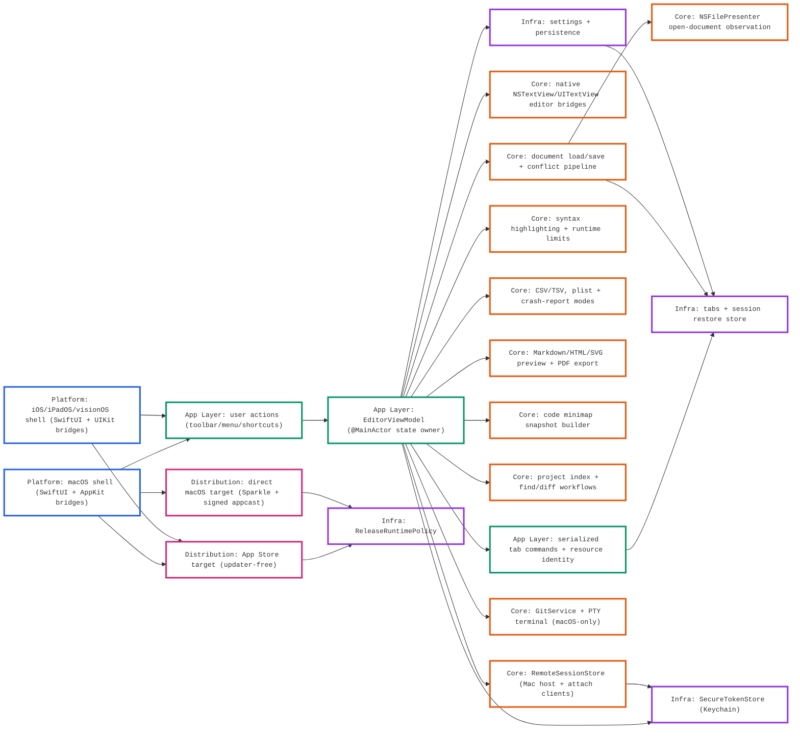

- `EditorViewModel` is the single UI-facing orchestration point per window/scene.
- Serialized tab commands separate a UI tab from the document resource it represents, preserving per-document cursor and viewport state across asynchronous loads and refreshes.
- Open local documents use `NSFilePresenter` events and bounded metadata/content checks. Clean buffers refresh in place; dirty buffers enter Keep Local, Reload from Disk, or Compare.
- Native editor bridges own TextKit/UIKit allocation and scrolling. SwiftUI owns pane allocation, including the macOS wrapped source/preview split.
- File access, parsing, diffing, structured snapshots, and other heavy work stay off the main actor; UI state mutations return to `@MainActor`.
- Platform shells stay thin. visionOS shares the UIKit-family editor while adapting presentation for spatial layouts.
- Remote sessions stay opt-in; macOS owns SSH and broker hosting while iPhone, iPad, and Apple Vision Pro attach as clients.
- App Store builds are updater-free. The separate direct macOS target links Sparkle and consumes the signed GitHub Pages appcast.
- Security-sensitive credentials and SSH-key bookmarks remain in Keychain (`SecureTokenStore`), not plain prefs.
- Color key: blue = platform shell, green = app orchestration, orange = core services, purple = infrastructure, pink = distribution products.

Full architecture reference: [`ARCHITECTURE.md`](ARCHITECTURE.md). The reference tracks the current Swift 6 cross-platform structure, platform guards, editor rendering paths, performance rules, distribution boundaries, and release verification workflow.

### Architecture principles

- Keep UI mutations on the main thread (`@MainActor`) and heavy work off the UI thread.
- Keep window/scene state isolated to avoid accidental cross-window coupling.
- Keep security defaults strict: tokens in Keychain, no telemetry by default.
- Keep platform wrappers thin and push shared behavior into common services.

## Platform Matrix

Neon Vision Editor shares its editor core across macOS, iPhone, iPad, and Apple Vision Pro. Platform-specific controls adapt to available space and input rather than exposing desktop-only workflows on touch devices.

> **Desktop-only workflows:** Git, the PTY Terminal, and SSH-hosted Remote Sessions run only on macOS. iPhone, iPad, and Apple Vision Pro remain editor, preview, and Remote Session client surfaces.

**Availability key:**  full native workflow ·  layout adapts to space and input ·  touch-first presentation ·  local desktop capability

### Shared Across All Platforms

- Native text editing, syntax highlighting, line wrap controls, bracket helper, and large-file safeguards.
- Opt-in Preview for Markdown, HTML, and SVG documents; previews are closed by default and use the same toolbar visibility control.
- Markdown formatting that wraps selections or inserts paired markers without one; heading, list, quote, code, link, image, and table actions are available from an adaptive control surface.
- Optional Code Minimap for supported languages, with viewport navigation and a draggable marker where space permits.
- Close All Tabs confirmation, unsupported-file safety alerts, and grouped Settings cards.

### Platform-Specific Differences and Features

| Capability | macOS | iPhone | iPad | Apple Vision Pro | Notes |
|---|---|---|---|---|---|
| Quick Open<br><sub>`Cmd+P`</sub> | <br><sub>Keyboard and menu</sub> | <br><sub>Hardware keyboard</sub> | <br><sub>Keyboard and menu</sub> | <br><sub>Hardware keyboard</sub> | Keyboard-first navigation remains available whenever a hardware keyboard is connected. |
| Project workspace | <br><sub>Files/Search/Git/Terminal rail</sub> | <br><sub>File workflow</sub> | <br><sub>Files/Search workflow</sub> | <br><sub>Spatial workspace</sub> | Git and Terminal execute only on macOS. |
| Find in Files | <br><sub>Sidebar</sub> | <br><sub>Sheet</sub> | <br><sub>Sidebar</sub> | <br><sub>Panel</sub> | On Mac and iPad, results remain visible while opening a match. |
| Markdown formatting | <br><sub>Collapsible toolbar below tabs</sub> | <br><sub>`Aa` status-row menu</sub> | <br><sub>Collapsible toolbar below tabs</sub> | <br><sub>Collapsible toolbar below tabs</sub> | Direct Bold, Italic, Link, Quote, and Code actions; structural actions and five heading levels remain available in menus. |
| Preview<br><sub>Markdown, HTML, SVG</sub> | <br><sub>Inline split pane</sub> | <br><sub>Full-screen sheet</sub> | <br><sub>Inline pane in regular width</sub> | <br><sub>Inline pane</sub> | The eye control is enabled only for supported documents and also closes the active preview. |
| Preview appearance | <br><sub>Templates and backgrounds</sub> | <br><sub>Templates and compact controls</sub> | <br><sub>Templates and backgrounds</sub> | <br><sub>System Glass, Paper, Slate, or Ink</sub> | visionOS intentionally uses its own reader surfaces instead of the full Markdown template collection. |
| Font-size gesture | <br><sub>Trackpad pinch</sub> | <br><sub>Touch pinch</sub> | <br><sub>Touch pinch</sub> | <br><sub>Touch pinch</sub> | Gestures adjust editor font size from 10 to 28 pt and retain the regular font-size controls. |
| Code Minimap | <br><sub>Opt-in</sub> | <br><sub>Opt-in</sub> | <br><sub>Opt-in</sub> | <br><sub>Opt-in</sub> | Available for supported languages; it stays hidden for document types where a minimap is not useful. |
| Diff workflows | <br><sub>Inline</sub> | <br><sub>Sheet</sub> | <br><sub>Inline</sub> | <br><sub>Panel</sub> | Compact presentations avoid taking over narrow touch layouts. |
| Git and Terminal | <br><sub>Local Git and PTY terminal</sub> | -- | -- | -- | These use local macOS executables and are deliberately not exposed on mobile or spatial platforms. |
| Remote sessions | <br><sub>SSH owner and broker host</sub> | <br><sub>Broker attach client</sub> | <br><sub>Broker attach client</sub> | <br><sub>Broker attach client</sub> | Remote access is opt-in; iPhone, iPad, and visionOS explicitly save through a Mac-hosted session. |
| Save and export | <br><sub>Native Save As and export</sub> | <br><sub>System exporter</sub> | <br><sub>System exporter</sub> | <br><sub>System exporter</sub> | iPhone and iPad export Markdown and Swift with their declared content types. |

## Trust & Reliability Signals

- Notarized release pipeline: [release-notarized.yml](https://github.com/h3pdesign/Neon-Vision-Editor/actions/workflows/release-notarized.yml)
- Pre-release verification gate: [pre-release-ci.yml](https://github.com/h3pdesign/Neon-Vision-Editor/actions/workflows/pre-release-ci.yml)
- Security scanning: [CodeQL workflow](https://github.com/h3pdesign/Neon-Vision-Editor/actions/workflows/codeql.yml)
- Homebrew cask sync: [update-cask.yml](https://github.com/h3pdesign/homebrew-tap/actions/workflows/update-cask.yml)

More release integrity details: [Release Integrity](#release-integrity)

## Platform Gallery

- [macOS](#macos)
- [iPad](#ipad)
- [iPhone](#iphone)
- Source image index for docs: [`docs/images/README.md`](docs/images/README.md)
- App Store gallery: [Neon Vision Editor on App Store](https://apps.apple.com/de/app/neon-vision-editor/id6758950965)
- Latest release assets: [GitHub Releases](https://github.com/h3pdesign/Neon-Vision-Editor/releases)

### macOS

<table align="center">
  <tr>
    <td align="center">
      <a href="docs/images/mac-light-editor-sidebar.png">
        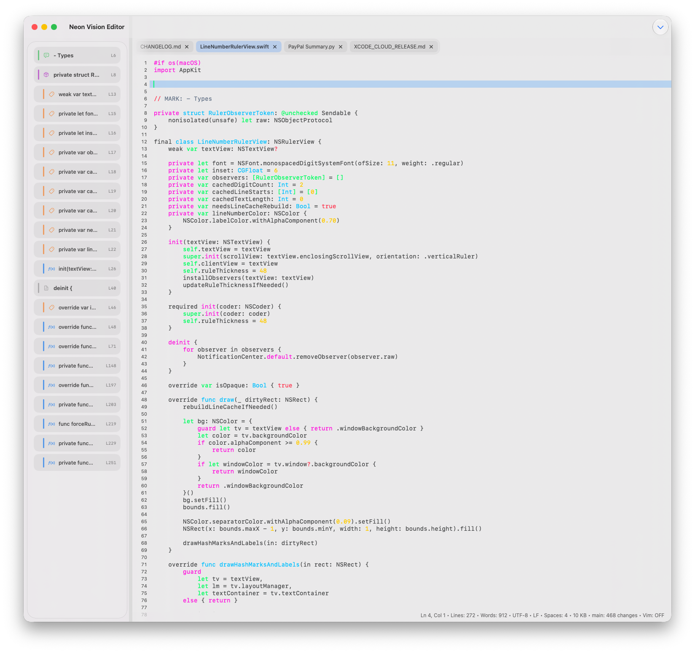
      </a><br>
      <sub>Light editor workspace with symbol navigation</sub>
    </td>
    <td align="center">
      <a href="docs/images/mac-light-editor-wide.png">
        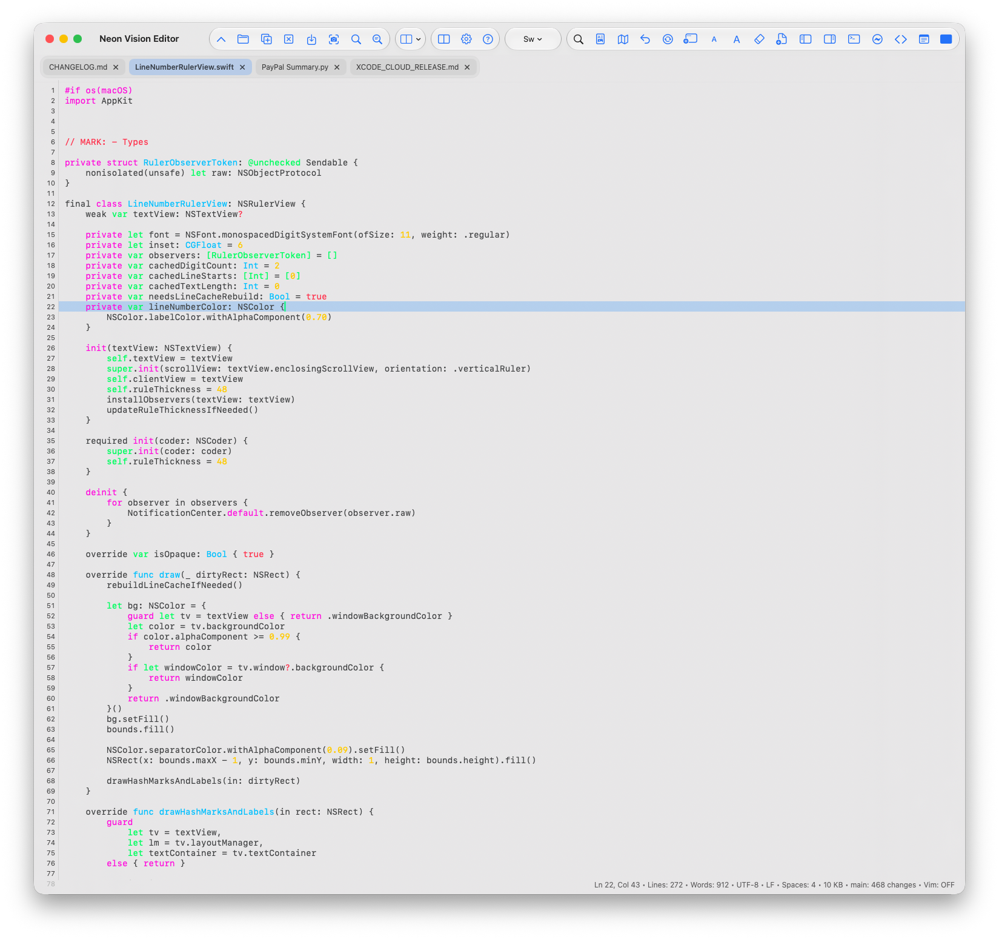
      </a><br>
      <sub>Wide light editor workspace with toolbar actions</sub>
    </td>
  </tr>
  <tr>
    <td align="center">
      <a href="docs/images/mac-light-editor-compact.png">
        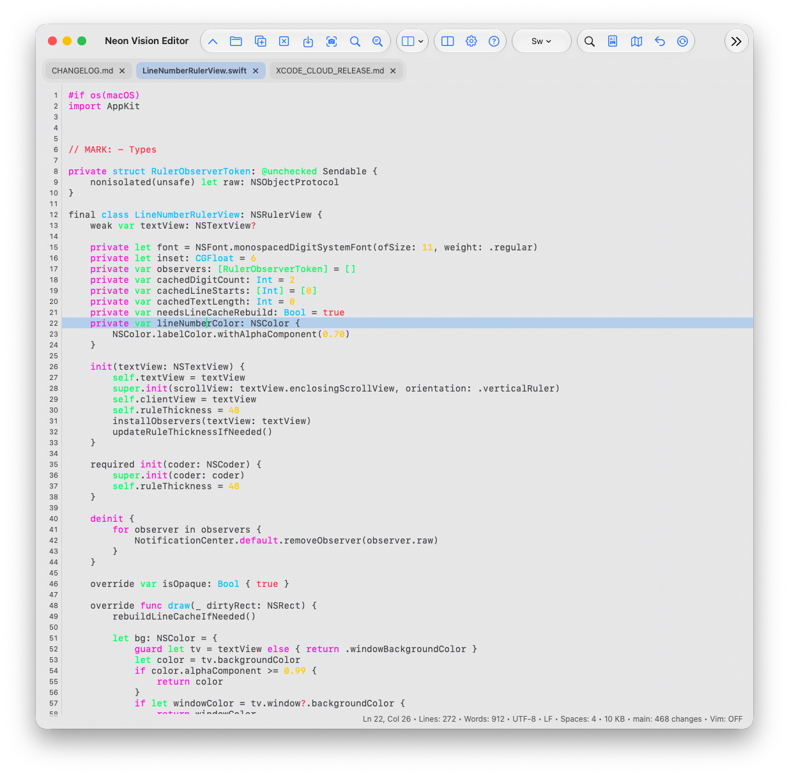
      </a><br>
      <sub>Compact light editor workspace with focused code view</sub>
    </td>
    <td align="center">
      <a href="docs/images/mac-light-editor-minimap.png">
        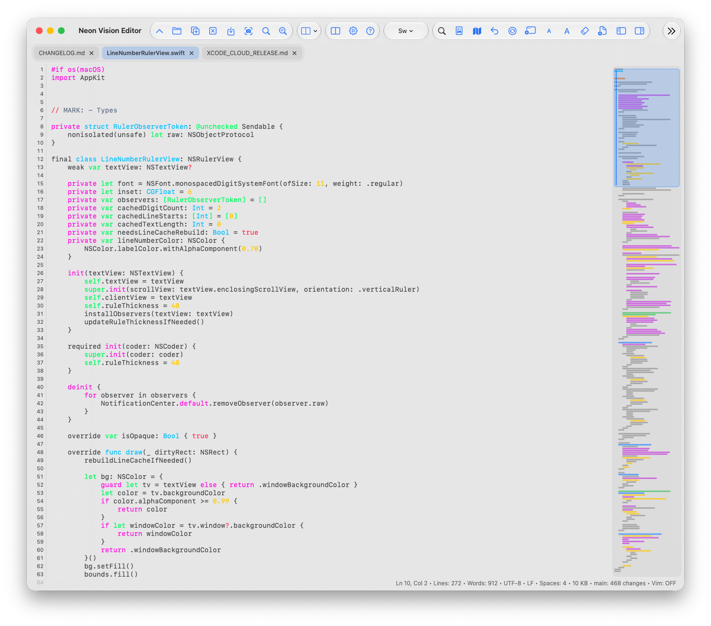
      </a><br>
      <sub>Light editor workspace with code minimap</sub>
    </td>
  </tr>
</table>

### iPad

<table align="center">
  <tr>
    <td align="center">
      <a href="docs/images/ipad-editor-light.png">
        
      </a><br>
      <sub>Project navigation and editing workflow on iPad</sub>
    </td>
    <td align="center">
      <a href="docs/images/ipad-editor-dark.png">
        
      </a><br>
      <sub>Markdown preview workflow in the editor context</sub>
    </td>
  </tr>
</table>

### iPhone

<div align="center">
  <table width="100%" style="max-width: 760px; margin: 0 auto;">
    <tr>
      <td align="center" width="50%">
        <a href="docs/images/iphone-editor-light-frame-updated.png">
          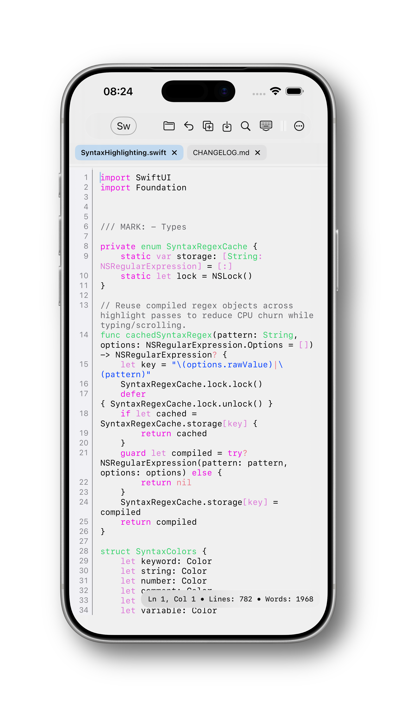
        </a><br>
        <sub>Editing workflow with syntax highlighting and accessory bar</sub>
      </td>
      <td align="center" width="50%">
        <a href="docs/images/iphone-menu-dark-frame.png">
          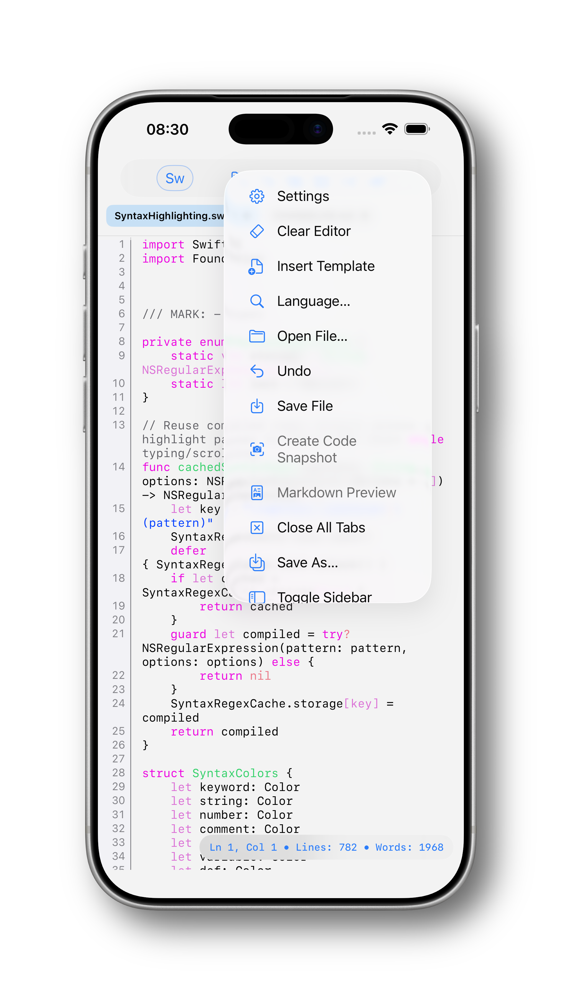
        </a><br>
        <sub>Overflow menu actions in the editor workflow</sub>
      </td>
    </tr>
    <tr>
      <td align="center" width="50%">
        <a href="docs/images/iphone-markdown-preview-dark.png">
          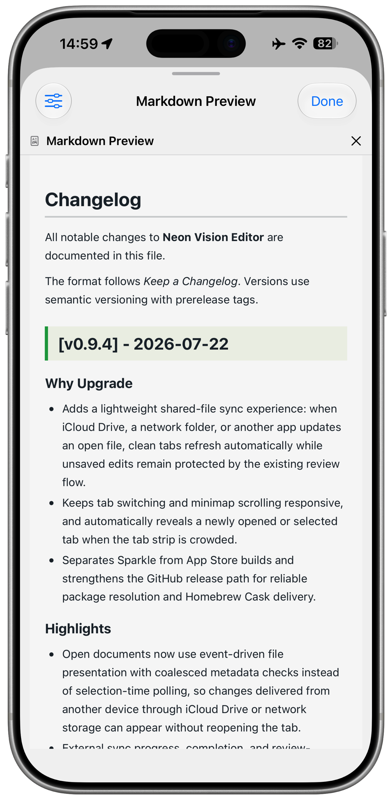
        </a><br>
        <sub>Markdown preview sheet with template, PDF mode, and export action</sub>
      </td>
      <td align="center" width="50%">
        <a href="docs/images/iphone-themes-light-frame.png">
          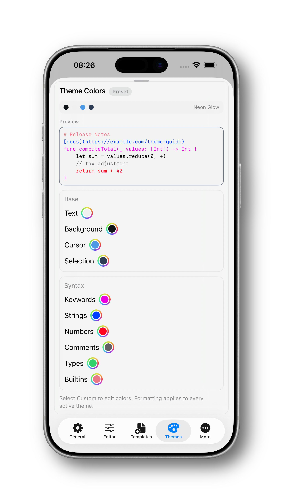
        </a><br>
        <sub>Theme color editing on iPhone</sub>
      </td>
    </tr>
  </table>
</div>

## Release Train

| Track | Current Focus | Status |
|---|---|---|
| Stable direct download | `v0.9.4` notarized GitHub release | Current |
| App Store rollout | Platform releases are published independently after App Review | Check the relevant App Store listing |
| Post-0.8 stabilization | Crash triage, docs freshness, platform polish, App Store/Xcode Cloud release checks | Next patch train |
| Larger workflow work | Remote workflow hardening, minimap polish, project navigation refinements | Later `v0.8+` work |

## Roadmap (Near Term)

<p align="center">
  
  
  
</p>

### Now (v0.9.4)

-  focuses on editor interaction polish, Markdown preview stability, local custom AI endpoints, sidebar terminal improvements, and release workflow hardening.
  Tracking: [Release v0.9.4](https://github.com/h3pdesign/Neon-Vision-Editor/releases/tag/v0.9.4)

### Next (v0.9.5)

-  targets post-0.9.4 stabilization: App Store review follow-up, README/release metadata freshness, preview polish, and small cross-platform editor fixes.
  Tracking: [Milestones](https://github.com/h3pdesign/Neon-Vision-Editor/milestones)

### Later (v0.8+)

-  larger workflow expansion after the current cross-platform editor baseline is verified, with remote workflows and navigation surfaces kept opt-in until they are fully hardened.

## Known Issues

- Open known issues (live filter): [label:known-issue](https://github.com/h3pdesign/Neon-Vision-Editor/issues?q=is%3Aissue%20is%3Aopen%20label%3Aknown-issue)

## Troubleshooting

1. Markdown preview not visible: use the preview action from an open Markdown file; iPhone presents preview in a sheet, while macOS and iPadOS can show it inline.
2. Shortcut not working on iOS: connect a hardware keyboard for shortcut-based flows like `Cmd+P`.
3. Sidebar/layout feels cramped on iPad: switch orientation or close side panels before preview.
4. Settings feel off after updates: quit/relaunch app and verify current release version in Settings.
5. Remote connection refused on a local Mac target: enable **System Settings > General > Sharing > Remote Login**, then start the Remote session again.

## Configuration

- Theme and appearance: `Settings > Designs`
- Appearance/theme iCloud sync: `Settings > Allgemein/General > Window`
- Editor behavior (font, line height, wrapping, snippets, minimap): `Settings > Editor`
- Startup/session behavior: `Settings > Allgemein/General`
- Remote sessions: `Settings > Mehr/More > Remote` or `Settings > Remote` on wider layouts
- Support and purchase options: `Settings > Mehr/More` (platform-dependent)

## FAQ

- **Does Neon Vision Editor support Intel Macs?**  
  Intel is currently not fully validated. If you can help test, see [Help wanted: Intel Mac test coverage](https://github.com/h3pdesign/Neon-Vision-Editor/issues/41).
- **Can I use it offline?**  
  Yes for core editing. Network is only used for explicit actions such as selected AI providers, update checks, GitHub release downloads, or opt-in Remote Sessions.
- **Do I need AI enabled to use the editor?**  
  No. Core editing, navigation, and preview features work without AI.
- **Where are tokens stored?**  
  In Keychain via `SecureTokenStore`, not in `UserDefaults`.

## Keyboard Shortcuts

All shortcuts use `Cmd` (`⌘`). iPhone, iPad, and Apple Vision Pro require an external hardware keyboard. The table shows defaults; selected editor shortcuts can be customized in **Settings > Shortcuts**.

**Availability key:**  assigned shortcut ·  external keyboard required ·  desktop command

### File and Editing

| Shortcut | Action | macOS | iPhone | iPad | Apple Vision Pro |
|---|---|---|---|---|---|
| `Cmd+N` | New Window |  | -- | -- | -- |
| `Cmd+T` | New Tab |  |  |  |  |
| `Cmd+O` | Open File |  |  |  |  |
| `Cmd+Shift+O` | Open Folder |  |  |  |  |
| `Cmd+S` | Save |  |  |  |  |
| `Cmd+Shift+S` | Save As |  |  |  |  |
| `Cmd+W` | Close Tab |  | -- |  | -- |
| `Cmd+X`, `Cmd+C`, `Cmd+V`, `Cmd+A` | Cut, Copy, Paste, Select All |  |  |  |  |
| `Cmd+Z`, `Cmd+Shift+Z` | Undo, Redo |  |  |  |  |
| `Cmd+B`, `Cmd+I`, `Cmd+K` | Bold, Italic, Link in Markdown |  | -- |  | -- |

### Navigation and View

| Shortcut | Action | macOS | iPhone | iPad | Apple Vision Pro |
|---|---|---|---|---|---|
| `Cmd+F`, `Cmd+G` | Find, Find Next |  |  |  |  |
| `Cmd+Shift+F` | Find in Files |  |  |  |  |
| `Cmd+P` | Quick Open |  | -- | -- | -- |
| `Cmd+L` | Go to Line |  | -- | -- | -- |
| `Cmd+Shift+J` | Go to Symbol |  | -- | -- | -- |
| `Cmd+Option+S` | Toggle Sidebar |  |  |  |  |
| `Cmd+Option+L` | Toggle Line Wrap |  |  |  |  |
| `Cmd+Option+M` | Toggle Code Minimap |  | -- | -- | -- |
| `Cmd+,`, `Cmd+?` | Settings, Toolbar Help |  |  |  |  |

### macOS-Only Tools

| Shortcut | Action | Availability |
|---|---|---|
| `Cmd+D` | Add Next Match |  |
| `Cmd+Shift+D` | Brain Dump Mode |  |
| `Cmd+Shift+V` | Toggle Vim Mode |  |
| `Cmd+Shift+G` | Suggest Code |  |
| `Cmd+Shift+L` | AI Activity Log |  |
| `Cmd+Shift+U` | Inspect whitespace at caret |  |

Vim navigation is also available on iPad with a hardware keyboard after enabling Vim mode; arrow keys and the standard Vim movement keys work in Normal mode.

## Changelog

Latest stable: **v0.9.4** (2026-07-22)

### Recent Releases (At a glance)

| Version | Date | Highlights | Fixes | Breaking changes | Migration |
|---|---|---|---|---|---|
| [`v0.9.4`](https://github.com/h3pdesign/Neon-Vision-Editor/releases/tag/v0.9.4) | 2026-07-22 | Open documents now use event-driven file presentation with coalesced metadata checks instead of selection-time polling, so changes delivered from another device through iCloud Drive or network storage can appear without reopening the tab; External sync progress, completion, and review-needed states appear in the editor status area for one or multiple tabs; the shared storage remains the transport and Neon Vision Editor supplies open-tab refresh and conflict protection; GitHub-hosted releases can prepare the Homebrew Cask update branch with a GitHub App token and provide a direct pull-request link in the workflow summary | Preserves cursor, selection, source viewport, and minimap state when a clean document refreshes in place, including inactive tabs and Markdown preview sources; Never replaces a dirty buffer after an external change; the existing Keep Local, Reload from Disk, and Compare actions remain authoritative; Removes broad tab-state publication and filesystem checks from ordinary tab selection, and reduces minimap work during editor scrolling | None noted | None required |
| [`v0.9.3`](https://github.com/h3pdesign/Neon-Vision-Editor/releases/tag/v0.9.3) | 2026-07-21 | Wrapped macOS editors now let TextKit follow the width allocated by the SwiftUI split layout | Removes transition-time text-view width and frame overrides that could retain a stale source-pane width; Keeps Sparkle isolated to macOS while preserving the non-macOS updater branch; Updates the macOS wrap regression test to verify native viewport width tracking instead of forced document geometry | None noted | None required |
| [`v0.9.2`](https://github.com/h3pdesign/Neon-Vision-Editor/releases/tag/v0.9.2) | 2026-07-21 | Retains the existing per-tab cursor, viewport, minimap, and iPad keyboard-restoration behavior from v0.9.1 | Avoids forcing full TextKit layout while publishing minimap viewport updates during macOS scrolling; Avoids invalidating the editor display on every scroll-position change while continuing to refresh after size changes and document installation | None noted | None required |

- Full release history: [`CHANGELOG.md`](CHANGELOG.md)
- Latest release: **v0.9.4**
- Compare recent changes: [v0.9.3...v0.9.4](https://github.com/h3pdesign/Neon-Vision-Editor/compare/v0.9.3...v0.9.4)

## Known Limitations

- Intel Mac support is not fully validated yet.
- Vim mode is intentionally lightweight, not full Vim emulation.
- iPhone and iPad workflows still offer a smaller feature set than macOS.

## Privacy & Security

- Privacy policy: [`PRIVACY.md`](PRIVACY.md).
- API keys are stored in Keychain (`SecureTokenStore`), not `UserDefaults`.
- Network traffic uses HTTPS.
- No telemetry.
- External AI requests only occur when code completion is enabled and a provider is selected.
- Remote Sessions are opt-in and user-triggered; when enabled, broker payloads are encrypted and SSH-key bookmarks stay in Keychain.
- Security policy and reporting details: [`SECURITY.md`](SECURITY.md).
- New repository commits are SSH-signed; older historical commits may still predate commit signing.
- Local SSH-signature verification uses a private allowed-signers file outside the repository.

## Release Integrity

- Tag: `v0.9.4`
- Tagged commit: release tag target
- Verify local tag target:

```bash
git rev-parse --verify v0.9.4
```

- Verify downloaded artifact checksum locally:

```bash
shasum -a 256 <downloaded-file>
```

- Verify local SSH commit signatures in this clone:

```bash
git config --local gpg.ssh.allowedSignersFile "$HOME/.config/git/allowed_signers"
git log --show-signature -1
```

## Release Policy

- `Stable`: tagged GitHub releases intended for daily use.
- `Beta`: TestFlight builds may include in-progress UX and platform polish.
- Cadence: fixes/polish can ship between minor tags, with summary notes mirrored in README and `CHANGELOG.md`.

## Requirements

### App Runtime

- Designed and tested for macOS 26 (Tahoe), with compatibility work for macOS 15 Sequoia.
- Xcode deployment target: macOS 15.0; iOS/iPadOS 18.6.
- Apple Silicon recommended

### Build Requirements

- Xcode with the macOS 26 SDK/toolchain for current release assets and icon payloads.
- iOS and iPadOS simulator runtimes installed in Xcode for cross-platform verification

## Build from source

If you already completed the [Start in 60s (Source Build)](#start-in-60s-source-build), you can open and run directly from Xcode.

```bash
git clone https://github.com/h3pdesign/Neon-Vision-Editor.git
cd Neon-Vision-Editor
open "Neon Vision Editor.xcodeproj"
```

## Contributing Quickstart

Contributor guide: [`CONTRIBUTING.md`](CONTRIBUTING.md)

1. Fork the repo and create a focused branch.
2. Implement the smallest safe diff for your change.
3. Build on macOS first.
4. Run cross-platform verification script.
5. Open a PR with screenshots for UI changes and a short risk note.
6. Link to related issue/milestone and call out user-visible impact.

```bash
git clone https://github.com/h3pdesign/Neon-Vision-Editor.git
cd Neon-Vision-Editor
xcodebuild -project "Neon Vision Editor.xcodeproj" -scheme "Neon Vision Editor" -destination 'platform=macOS,name=My Mac' build
```

Lock-safe cross-platform verification (sequential macOS + iOS Simulator + iPad Simulator):

```bash
scripts/ci/build_platform_matrix.sh
```

## Support & Feedback

### Feedback Pulse

Share what works well and what should improve for both the app and the README.

<p align="center">
  <a href="https://github.com/h3pdesign/Neon-Vision-Editor/issues?q=is%3Aissue%20is%3Aopen%20%22%5BPositive%20Feedback%5D%22%20in%3Atitle">
    
  </a>
  &nbsp;
  <a href="https://github.com/h3pdesign/Neon-Vision-Editor/issues?q=is%3Aissue%20is%3Aopen%20%22%5BNegative%20Feedback%5D%22%20in%3Atitle">
    
  </a>
</p>
<p align="center">
  <a href="https://github.com/h3pdesign/Neon-Vision-Editor/issues/new?template=feature_request.yml&title=%5BPositive%20Feedback%5D%20App%2FREADME%3A%20">Share positive feedback</a>
  &nbsp;·&nbsp;
  <a href="https://github.com/h3pdesign/Neon-Vision-Editor/issues/new?template=bug_report.yml&title=%5BNegative%20Feedback%5D%20App%2FREADME%3A%20">Share negative feedback</a>
</p>

- Questions and ideas: [GitHub Discussions](https://github.com/h3pdesign/Neon-Vision-Editor/discussions)
- Project board (Now / Next / Later): [Neon Vision Editor Roadmap](https://github.com/users/h3pdesign/projects/2)
- Known issues: [Known Issues Hub #50](https://github.com/h3pdesign/Neon-Vision-Editor/issues/50)
- Contributor entry points: [good first issue](https://github.com/h3pdesign/Neon-Vision-Editor/issues?q=is%3Aissue%20is%3Aopen%20label%3A%22good%20first%20issue%22) | [help wanted](https://github.com/h3pdesign/Neon-Vision-Editor/issues?q=is%3Aissue%20is%3Aopen%20label%3A%22help%20wanted%22)
- Issue filters: [enhancement](https://github.com/h3pdesign/Neon-Vision-Editor/issues?q=is%3Aissue%20is%3Aopen%20label%3Aenhancement) | [known-issue](https://github.com/h3pdesign/Neon-Vision-Editor/issues?q=is%3Aissue%20is%3Aopen%20label%3Aknown-issue) | [regression](https://github.com/h3pdesign/Neon-Vision-Editor/issues?q=is%3Aissue%20is%3Aopen%20label%3Aregression)

### Support Neon Vision Editor

Keep it free, sustainable, and improving.

<p align="center">
  <a href="https://buymeacoffee.com/h3pdesign">
    
  </a>
  <a href="https://www.patreon.com/h3p">
    
  </a>
  <a href="https://www.paypal.com/paypalme/HilthartPedersen">
    
  </a>
</p>

- Neon Vision Editor will always stay free to use.
- No subscriptions and no paywalls.
- Keeping the app alive still has real costs: Apple Developer Program fee, maintenance, updates, and long-term support.
- Optional Support Tip (Consumable): **$4.99** and can be purchased multiple times.
- Your support helps cover Apple developer fees, bug fixes and updates, future improvements and features, and long-term support.
- Thank you for helping keep Neon Vision Editor free for everyone.

- In-app support tip: `Settings > Mehr/More` (platform-dependent)
- External support: [Buy Me a Coffee](https://buymeacoffee.com/h3pdesign)
- External support: [Patreon](https://www.patreon.com/h3p)
- h3p apps portal for docs, setup guides, and release workflows: [>h3p apps](https://apps-h3p.com)
- External support: [PayPal](https://www.paypal.com/paypalme/HilthartPedersen)

### Creator Sites

<p align="center">
  <a href="https://h3p.me/home">
    
  </a>
  <a href="https://apps-h3p.com">
    
  </a>
</p>

- Discussions categories: [Ideas](https://github.com/h3pdesign/Neon-Vision-Editor/discussions/categories/ideas) | [Q&A](https://github.com/h3pdesign/Neon-Vision-Editor/discussions/categories/q-a) | [Showcase](https://github.com/h3pdesign/Neon-Vision-Editor/discussions/categories/show-and-tell)

## Git hooks

To auto-increment Xcode `CURRENT_PROJECT_VERSION` on every commit:

```bash
scripts/install_git_hooks.sh
```

## Changed License

Neon Vision Editor is licensed under the Apache License, Version 2.0.
See [`LICENSE`](LICENSE).

The project moved to Apache-2.0 because it keeps the same permissive open-source
model while adding an explicit patent grant and patent-termination protection for
contributors and downstream users. This better matches a developer tool that may
receive contributions, integrations, and commercial redistribution over time.
