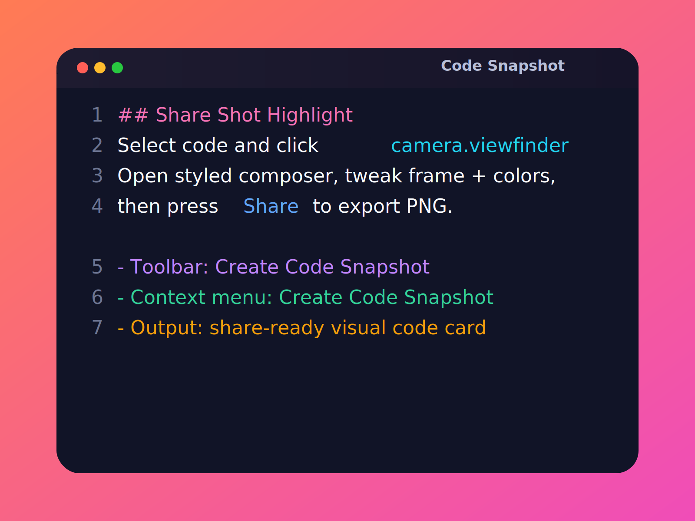
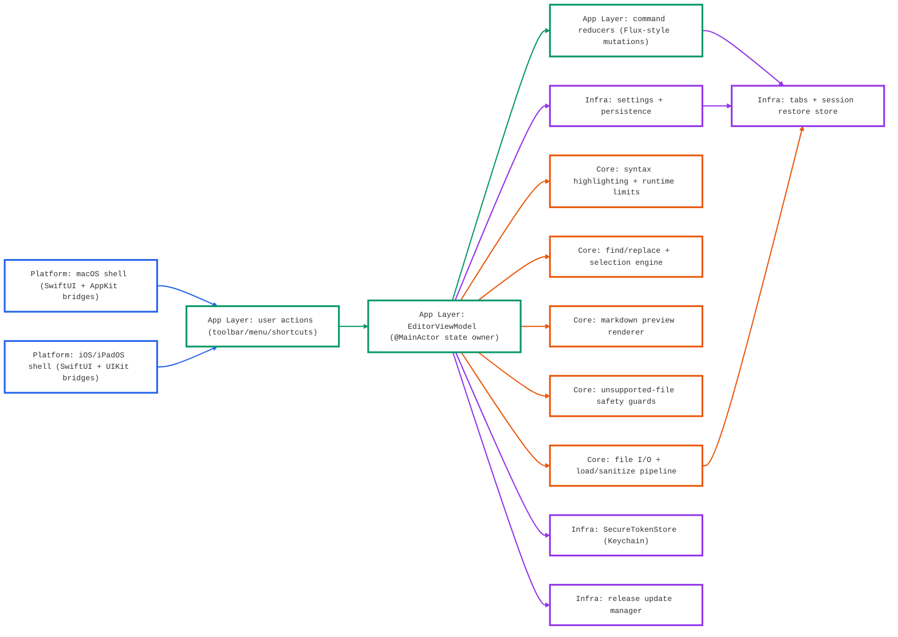

<p align="center"><a href="https://apps-h3p.com"></a><a href="https://www.patreon.com/h3p"></a><a href="https://www.paypal.com/paypalme/HilthartPedersen"></a></p>

<p align="center">
  <a href="https://github.com/h3pdesign/Neon-Vision-Editor/releases"></a>
  <a href="https://apps.apple.com/de/app/neon-vision-editor/id6758950965"></a>
  <a href="https://github.com/h3pdesign/Neon-Vision-Editor/actions/workflows/release-notarized.yml"></a>
  <a href="https://github.com/h3pdesign/homebrew-tap/actions/workflows/update-cask.yml"></a>
  <a href="https://github.com/h3pdesign/Neon-Vision-Editor/blob/main/LICENSE"></a>
</p>

<p align="center">&nbsp;</p>

<div align="center">
  <br>
  
</div>

<p align="center">&nbsp;</p>

<p align="center">
  
</p>

<p align="center">
  <strong><span style="font-size: 1.2em;">A native editor for markdown, notes, and code across macOS, iPhone, and iPad.</span></strong>
</p>

<p align="center">
  Minimal by design. Quick edits, fast file access, no IDE bloat.
</p>

<p align="center">&nbsp;</p>

<p align="center">
  <strong>Download:</strong>
  <a href="https://github.com/h3pdesign/Neon-Vision-Editor/releases">GitHub Releases</a>
  ·
  <a href="https://apps.apple.com/de/app/neon-vision-editor/id6758950965">App Store</a>
  ·
  <a href="https://testflight.apple.com/join/YWB2fGAP">TestFlight</a>
</p>

<h3 align="center">Feedback Pulse</h3>
<p align="center">
  <sub>Share what works well and what should improve for both the app and the README.</sub>
</p>
<p align="center">
  <a href="https://github.com/h3pdesign/Neon-Vision-Editor/issues?q=is%3Aissue%20is%3Aopen%20%22%5BPositive%20Feedback%5D%22%20in%3Atitle">
    
  </a>
  &nbsp;
  <a href="https://github.com/h3pdesign/Neon-Vision-Editor/issues?q=is%3Aissue%20is%3Aopen%20%22%5BNegative%20Feedback%5D%22%20in%3Atitle">
    
  </a>
</p>
<p align="center">
  <a href="https://github.com/h3pdesign/Neon-Vision-Editor/issues/new?template=feature_request.yml&title=%5BPositive%20Feedback%5D%20App%2FREADME%3A%20">Share positive feedback</a>
  &nbsp;·&nbsp;
  <a href="https://github.com/h3pdesign/Neon-Vision-Editor/issues/new?template=bug_report.yml&title=%5BNegative%20Feedback%5D%20App%2FREADME%3A%20">Share negative feedback</a>
</p>


> Status: **active release**  
> Latest release: **v0.5.6**
> Platform target: **macOS 26 (Tahoe)** compatible with **macOS Sequoia**
> Apple Silicon: tested / Intel: not tested
> Last updated (README): **2026-03-18** for release line **v0.5.6**

## Start Here

- Jump: [Install](#install) | [Features](#features) | [Contributing](#contributing-quickstart)
- Quick install: [GitHub Releases](https://github.com/h3pdesign/Neon-Vision-Editor/releases), [App Store](https://apps.apple.com/de/app/neon-vision-editor/id6758950965), [TestFlight](https://testflight.apple.com/join/YWB2fGAP)
- Need help quickly: [Troubleshooting](#troubleshooting) | [FAQ](#faq) | [Known Issues](#known-issues)

### Start in 60s (Source Build)

1. `git clone https://github.com/h3pdesign/Neon-Vision-Editor.git`
2. `cd Neon-Vision-Editor`
3. `xcodebuild -project "Neon Vision Editor.xcodeproj" -scheme "Neon Vision Editor" -destination 'platform=macOS,name=My Mac' build`
4. `open "Neon Vision Editor.xcodeproj"` and run, then use `Cmd+P` for Quick Open.

| For | Not For |
|---|---|
| Fast native editing across macOS, iOS, iPadOS | Full IDE workflows with deep refactoring/debugger stacks |
| Markdown writing and script/config edits with highlighting | Teams that require complete Intel Mac validation today |
| Users who want low overhead and quick file access | Users expecting full desktop-IDE parity on iPhone |

## Table of Contents

<p align="center">
  <a href="#start-here">Start Here</a> ·
  <a href="#release-channels">Release Channels</a> ·
  <a href="#download-metrics">Download Metrics</a> ·
  <a href="#project-docs">Project Docs</a> ·
  <a href="#features">Features</a> ·
  <a href="#new-feature-spotlight">New Feature</a> ·
  <a href="#platform-matrix">Platform Matrix</a><br>
  <a href="#roadmap-near-term">Roadmap (Near Term)</a> ·
  <a href="#troubleshooting">Troubleshooting</a> ·
  <a href="#faq">FAQ</a> ·
  <a href="#changelog">Changelog</a> ·
  <a href="#contributing-quickstart">Contributing Quickstart</a> ·
  <a href="#support--feedback">Support & Feedback</a>
</p>

## Release Channels

<div align="center">
  <table>
    <thead>
      <tr>
        <th>Channel</th>
        <th>Best for</th>
        <th>Delivery</th>
      </tr>
    </thead>
    <tbody>
      <tr>
        <td></td>
        <td>Direct notarized builds and fastest stable updates</td>
        <td><a href="https://github.com/h3pdesign/Neon-Vision-Editor/releases">GitHub Releases</a></td>
      </tr>
      <tr>
        <td></td>
        <td>Apple-managed install/update flow</td>
        <td><a href="https://apps.apple.com/de/app/neon-vision-editor/id6758950965">App Store</a></td>
      </tr>
      <tr>
        <td></td>
        <td>Early testing of upcoming changes</td>
        <td><a href="https://testflight.apple.com/join/YWB2fGAP">TestFlight</a></td>
      </tr>
    </tbody>
  </table>
</div>

## Download Metrics

<p align="center">
  
  
</p>

<p align="center"><strong>Release Download + Traffic Trend</strong></p>

<p align="center">
  
</p>

<p align="center"><em>Styled line chart shows per-release totals with 14-day traffic counters for clones and views.</em></p>
<p align="center">
  
  
</p>
<p align="center">
  
  
</p>
## Project Docs

- Release history: [`CHANGELOG.md`](CHANGELOG.md)
- Contributing guide: [`CONTRIBUTING.md`](CONTRIBUTING.md)
- Privacy: [`PRIVACY.md`](PRIVACY.md)
- Security policy: [`SECURITY.md`](SECURITY.md)
- Release checklists: [`release/`](release/) — TestFlight & App Store preflight docs

## What's New Since v0.5.5

- Added Safe Mode startup recovery with repeated-failure detection and a `Normal Next Launch` recovery action.
- Added background project indexing for faster `Quick Open` and `Find in Files` in larger folders.
- Added Markdown preview PDF export with paginated and one-page output modes.
- Added an iPad hardware-keyboard Vim MVP with core normal-mode navigation and editing commands.
- Added theme formatting options for bold keywords, italic comments, underlined links, and bold Markdown headings.
- Fixed immediate application of theme-formatting changes and the related editor font-size regression.
- Fixed German Settings localization gaps and improved Settings layout density.

## Who Is This For?

| Best For | Why Neon Vision Editor |
|---|---|
| Quick note takers | Fast native startup and low UI overhead for quick edits |
| Markdown-focused writers | Clean editing with quick preview workflows on Apple devices |
| Developers editing scripts/config files | Syntax highlighting + fast file navigation without full IDE complexity |

## Why This Instead of a Full IDE?

| Advantage | What It Means |
|---|---|
| Faster startup | Lower overhead for short edit sessions |
| Focused surface | Editor-first workflow without project-system bloat |
| Native Apple behavior | Consistent experience on macOS, iOS, and iPadOS |

## Download

Prebuilt binaries are available on [GitHub Releases](https://github.com/h3pdesign/Neon-Vision-Editor/releases).

| Channel | Best For | Download | Release Track | Notes |
|---|---|---|---|---|
| **Stable** | Direct notarized builds and fastest stable updates | [GitHub Releases](https://github.com/h3pdesign/Neon-Vision-Editor/releases) | **v0.5.5** | Apple Silicon tested, Intel not fully validated |
| **Store** | Apple-managed installs and updates | [Neon Vision Editor on the App Store](https://apps.apple.com/de/app/neon-vision-editor/id6758950965) | App Store | Automatic Store delivery/update flow |
| **Beta** | Testing upcoming changes before stable | [TestFlight Invite](https://testflight.apple.com/join/YWB2fGAP) | TestFlight | Early access builds for feedback |

## Install

### Quick install (curl)

Install the latest release directly:

```bash
curl -fsSL https://raw.githubusercontent.com/h3pdesign/Neon-Vision-Editor/main/scripts/install.sh | sh
```

Install without admin password prompts (user-local app folder):

```bash
curl -fsSL https://raw.githubusercontent.com/h3pdesign/Neon-Vision-Editor/main/scripts/install.sh | sh -s -- --appdir "$HOME/Applications"
```

### Homebrew

```bash
brew tap h3pdesign/tap
brew install --cask neon-vision-editor
```

Tap repository: [h3pdesign/homebrew-tap](https://github.com/h3pdesign/homebrew-tap)

If Homebrew asks for an admin password, it is usually because casks install into `/Applications`.
Use this to avoid that:

```bash
brew install --cask --appdir="$HOME/Applications" neon-vision-editor
```

### Gatekeeper (macOS 26 Tahoe)

If macOS blocks first launch:

1. Open **System Settings**.
2. Go to **Privacy & Security**.
3. In **Security**, find the blocked app message.
4. Click **Open Anyway**.
5. Confirm the dialog.

## Features

Neon Vision Editor keeps the surface minimal and focuses on fast writing/coding workflows.
Platform-specific availability is tracked in the [Platform Matrix](#platform-matrix) section below.

<p align="center">
  
  
  
</p>
<p align="center">
  
  
  
</p>
<p align="center">
  
  
  
</p>
<p align="center">
  
  
  
  
</p>

### Editing Core

- Fast loading for regular and large text files with tabbed editing.
- Broad syntax highlighting (including TeX/LaTeX), inline completion with Tab-to-accept, and regex Find/Replace with Replace All.
- Optional Vim workflow support and starter templates for common languages.

### Navigation & Workflow

- Quick Open (`Cmd+P`), project sidebar navigation, and recursive project tree rendering.
- Project quick actions (`Expand All` / `Collapse All`) and supported-files-only filter.
- Cross-platform `Save As…` and Close All Tabs with confirmation.

### Preview, Platform, and Safety

- Native Markdown preview templates on macOS/iOS/iPadOS plus iPhone bottom-sheet preview.
- `.svg` file support via XML mode and bracket helper on all platforms.
- Unsupported-file open/import safety guards and session restore for previously opened project folder.

### Customization & Diagnostics

- Built-in theme collection: Dracula, One Dark Pro, Nord, Tokyo Night, Gruvbox, and Neon Glow.
- Grouped settings, optional StoreKit support flow, and AI Activity Log diagnostics on macOS.

## NEW FEATURE Spotlight

<p align="center">
  
</p>

**Featured in v0.5.6:** Safe Mode startup recovery with repeated-failure detection, blank-document launch fallback, a dedicated startup explanation, and a `Normal Next Launch` recovery action.

Create polished share images directly from your selected code.

<p align="center">
  <a href="docs/images/code-snapshot-showcase.svg">
    
  </a><br>
  <sub>Styled export preview for social sharing, changelogs, and issue discussions.</sub>
</p>

- Toolbar button: click  in the top toolbar (`Create Code Snapshot`).
- Selection menu: right-click selected text and choose `Create Code Snapshot`.
- Composer controls: choose appearance, background, frame style, line numbers, and padding.
- Export: use `Share` to generate a PNG snapshot and share/save it.

## Architecture At A Glance



- `EditorViewModel` is the single UI-facing orchestration point per window/scene.
- Commands mutate editor state predictably; session/tabs persist through store services.
- File access and parsing stay off the main thread; UI state changes stay on the main thread.
- Platform shells stay thin and route interactions into shared app/core services.
- Security-sensitive credentials remain in Keychain (`SecureTokenStore`), not plain prefs.
- Color key in diagram: blue = platform shell, green = app orchestration, orange = core services, purple = infrastructure.

### Architecture principles

- Keep UI mutations on the main thread (`@MainActor`) and heavy work off the UI thread.
- Keep window/scene state isolated to avoid accidental cross-window coupling.
- Keep security defaults strict: tokens in Keychain, no telemetry by default.
- Keep platform wrappers thin and push shared behavior into common services.

## Platform Matrix

Most editor features are shared across macOS, iOS, and iPadOS.

### Shared Across All Platforms

- Fast text editing with syntax highlighting.
- Markdown preview templates (Default, Docs, Article, Compact).
- Project sidebar with supported-files filter.
- Unsupported-file safety alerts.
- SVG (`.svg`) support via XML mode.
- Close All Tabs with confirmation.
- Bracket helper and grouped Settings cards.

### Platform-Specific Differences

| Capability | macOS | iOS | iPadOS | Notes |
|---|---|---|---|---|
| Quick Open<br><sub>`Cmd+P`</sub> |  |  |  | iOS needs a hardware keyboard<br>for shortcut-driven flow. |
| Bracket Helper |  |  |  | Same behavior across platforms;<br>only the UI surface differs. |
| Markdown Preview |  |  |  | Interaction adapts to screen size<br>and platform input model. |

## Trust & Reliability Signals

- Notarized release pipeline: [release-notarized.yml](https://github.com/h3pdesign/Neon-Vision-Editor/actions/workflows/release-notarized.yml)
- Latest successful notarized run: [main + success](https://github.com/h3pdesign/Neon-Vision-Editor/actions/workflows/release-notarized.yml?query=branch%3Amain+is%3Asuccess)
- Pre-release verification gate: [pre-release-ci.yml](https://github.com/h3pdesign/Neon-Vision-Editor/actions/workflows/pre-release-ci.yml)
- Latest successful pre-release run: [main + success](https://github.com/h3pdesign/Neon-Vision-Editor/actions/workflows/pre-release-ci.yml?query=branch%3Amain+is%3Asuccess)
- Security scanning: [CodeQL workflow](https://github.com/h3pdesign/Neon-Vision-Editor/actions/workflows/codeql.yml)
- Latest successful CodeQL run: [main + success](https://github.com/h3pdesign/Neon-Vision-Editor/actions/workflows/codeql.yml?query=branch%3Amain+is%3Asuccess)
- Homebrew cask sync workflow: [update-cask.yml](https://github.com/h3pdesign/Neon-Vision-Editor/actions/workflows/update-cask.yml)
- Latest successful Homebrew sync run: [homebrew-tap + success](https://github.com/h3pdesign/homebrew-tap/actions/workflows/update-cask.yml?query=is%3Asuccess)

## Platform Gallery

- [macOS](#macos)
- [iPad](#ipad)
- [iPhone](#iphone)
- Source image index for docs: [`docs/images/README.md`](docs/images/README.md)
- App Store gallery: [Neon Vision Editor on App Store](https://apps.apple.com/de/app/neon-vision-editor/id6758950965)
- Latest release assets: [GitHub Releases](https://github.com/h3pdesign/Neon-Vision-Editor/releases)

### macOS

<p align="center">
  <a href="docs/images/NeonVisionEditorApp.png">
    
  </a><br>
  <sub>macOS main editor window</sub>
</p>

### iPad

<table align="center">
  <tr>
    <td align="center">
      <a href="docs/images/ipad-editor-light.png">
        
      </a><br>
      <sub>Quick Open + Project Sidebar workflow</sub>
    </td>
    <td align="center">
      <a href="docs/images/ipad-editor-dark.png">
        
      </a><br>
      <sub>Markdown preview flow in editor context</sub>
    </td>
  </tr>
</table>

### iPhone

<div align="center">
  <table width="100%" style="max-width: 640px; margin: 0 auto;">
    <tr>
      <td align="center" width="50%">
        <a href="docs/images/iphone-themes-light.png">
          
        </a><br>
        <sub>Theme customization workflow</sub>
      </td>
      <td align="center" width="50%">
        <a href="docs/images/iphone-themes-dark.png">
          
        </a><br>
        <sub>Dark-theme editing preview</sub>
      </td>
    </tr>
    <tr>
      <td align="center" colspan="2">
        <a href="docs/images/iphone-menu.png">
          
        </a><br>
        <sub>Toolbar Menu Actions</sub>
      </td>
    </tr>
  </table>
</div>

## Release Flow (Completed + Upcoming)

<p align="center">
  <a href="docs/images/neon-vision-release-history-0.1-to-0.5-light.svg">
    <picture>
      <source media="(prefers-color-scheme: dark)" srcset="docs/images/neon-vision-release-history-0.1-to-0.5.svg">
      <source media="(prefers-color-scheme: light)" srcset="docs/images/neon-vision-release-history-0.1-to-0.5-light.svg">
      
    </picture>
  </a>
</p>
<p align="center"><sub>Click to open full-size SVG and zoom. In full view, each card links to release notes or the roadmap hub.</sub></p>

## Roadmap (Near Term)

<p align="center">
  
  
  
</p>

### Now (v0.5.4 - v0.5.6)

-  indexed project search and Open Recent favorites.  
  Tracking: [Milestone 0.5.3](https://github.com/h3pdesign/Neon-Vision-Editor/milestone/4) · [#29](https://github.com/h3pdesign/Neon-Vision-Editor/issues/29) · [#31](https://github.com/h3pdesign/Neon-Vision-Editor/issues/31)
-  large-file open mode, deferred/plain-text sessions, and stability work for huge documents.  
  Tracking: [Milestone 0.5.4](https://github.com/h3pdesign/Neon-Vision-Editor/milestone/5)
-  first-open/sidebar rendering stabilization, session-restore hardening, and Code Snapshot workflow polish.  
  Tracking: [Milestone 0.5.5](https://github.com/h3pdesign/Neon-Vision-Editor/milestone/6) · [Release v0.5.5](https://github.com/h3pdesign/Neon-Vision-Editor/releases/tag/v0.5.5)

### Next (v0.5.7 - v0.5.9)

-  Safe Mode startup.  
  Tracking: [#27](https://github.com/h3pdesign/Neon-Vision-Editor/issues/27)
-  incremental loading for huge files.  
  Tracking: [#28](https://github.com/h3pdesign/Neon-Vision-Editor/issues/28)
-  follow-up platform polish and release hardening.

### Later (v0.6.0)

-  native side-by-side diff view.  
  Tracking: [Milestone 0.6.0](https://github.com/h3pdesign/Neon-Vision-Editor/milestone/11) · [#33](https://github.com/h3pdesign/Neon-Vision-Editor/issues/33)

## Known Issues

- Open known issues (live filter): [label:known-issue](https://github.com/h3pdesign/Neon-Vision-Editor/issues?q=is%3Aissue%20is%3Aopen%20label%3Aknown-issue)

## Troubleshooting

1. App blocked on first launch: use Gatekeeper steps above in `Privacy & Security`.
2. Markdown preview not visible: ensure you are on macOS or iPadOS (not available on iPhone).
3. Shortcut not working on iOS: connect a hardware keyboard for shortcut-based flows like `Cmd+P`.
4. Sidebar/layout feels cramped on iPad: switch orientation or close side panels before preview.
5. Settings feel off after updates: quit/relaunch app and verify current release version in Settings.

## Configuration

- Theme and appearance: `Settings > Designs`
- Editor behavior (font, line height, wrapping, snippets): `Settings > Editor`
- Startup/session behavior: `Settings > Allgemein/General`
- Support and purchase options: `Settings > Mehr/More` (platform-dependent)

## FAQ

- **Does Neon Vision Editor support Intel Macs?**  
  Intel is currently not fully validated. If you can help test, see [Help wanted: Intel Mac test coverage](https://github.com/h3pdesign/Neon-Vision-Editor/issues/41).
- **Can I use it offline?**  
  Yes for core editing; network is only needed for optional external services (for example selected AI providers).
- **Do I need AI enabled to use the editor?**  
  No. Core editing, navigation, and preview features work without AI.
- **Where are tokens stored?**  
  In Keychain via `SecureTokenStore`, not in `UserDefaults`.

## Keyboard Shortcuts

All shortcuts use `Cmd` (`⌘`). iPad/iOS require a hardware keyboard.

 

### 

| Shortcut | Action | Platforms |
|---|---|---|
| `Cmd+N` | New Window |  |
| `Cmd+T` | New Tab |  |
| `Cmd+O` | Open File |  |
| `Cmd+Shift+O` | Open Folder |  |
| `Cmd+S` | Save |  |
| `Cmd+Shift+S` | Save As… |  |
| `Cmd+W` | Close Tab |  |

### 

| Shortcut | Action | Platforms |
|---|---|---|
| `Cmd+X` | Cut |  |
| `Cmd+C` | Copy |  |
| `Cmd+V` | Paste |  |
| `Cmd+A` | Select All |  |
| `Cmd+Z` | Undo |  |
| `Cmd+Shift+Z` | Redo |  |
| `Cmd+D` | Add Next Match |  |

### 

| Shortcut | Action | Platforms |
|---|---|---|
| `Cmd+Option+S` | Toggle Sidebar |  |
| `Cmd+Shift+D` | Brain Dump Mode |  |

### 

| Shortcut | Action | Platforms |
|---|---|---|
| `Cmd+F` | Find & Replace |  |
| `Cmd+G` | Find Next |  |
| `Cmd+Shift+F` | Find in Files |  |

### 

| Shortcut | Action | Platforms |
|---|---|---|
| `Cmd+P` | Quick Open |  |
| `Cmd+D` | Add next match |  |
| `Cmd+Shift+V` | Toggle Vim Mode |  |

###  

| Shortcut | Action | Platforms |
|---|---|---|
| `Cmd+Shift+G` | Suggest Code |  |
| `Cmd+Shift+L` | AI Activity Log |  |
| `Cmd+Shift+U` | Inspect Whitespace at Caret |  |

## Changelog

Latest stable: **v0.5.6** (2026-03-17)

### Recent Releases (At a glance)

| Version | Date | Highlights | Fixes | Breaking changes | Migration |
|---|---|---|---|---|---|
| [`v0.5.6`](https://github.com/h3pdesign/Neon-Vision-Editor/releases/tag/v0.5.6) | 2026-03-17 | Safe Mode startup recovery with repeated-failure detection, blank-document launch fallback, a dedicated startup explanation, and a `Normal Next Launch` recovery action; a background project file index for larger folders and wired it into `Quick Open`, `Find in Files`, and project refresh flows; Markdown preview PDF export with paginated and one-page output modes; an iPad hardware-keyboard Vim MVP with core normal-mode navigation/editing commands and shared mode-state reporting | Safe Mode so a successful launch clears recovery state and normal restarts no longer re-enter Safe Mode unnecessarily; Markdown PDF export clipping so long preview content is captured more reliably across page transitions and document endings; theme-formatting updates so editor styling refreshes immediately without requiring a theme switch | None noted | None required |
| [`v0.5.5`](https://github.com/h3pdesign/Neon-Vision-Editor/releases/tag/v0.5.5) | 2026-03-16 | Stabilized first-open rendering from the project sidebar so file content and syntax highlighting appear on first click without requiring tab switches; Hardened startup/session behavior so `Reopen Last Session` reliably wins over conflicting blank-document startup states; Refined large-file activation and loading placeholders to avoid misclassifying smaller files as large-file sessions; Share Shot (`Code Snapshot`) creation flow with toolbar + selection-context actions (`camera.viewfinder`) and a styled share/export composer | a session-restore regression where previously open files could appear empty on first sidebar click until changing tabs; highlight scheduling during document-state transitions (`switch`, `finish load`, external edits) on macOS, iOS, and iPadOS; startup-default conflicts by aligning defaults and runtime startup gating between `Reopen Last Session` and `Open with Blank Document` | None noted | None required |
| [`v0.5.4`](https://github.com/h3pdesign/Neon-Vision-Editor/releases/tag/v0.5.4) | 2026-03-13 | a dedicated large-file open mode with deferred first paint, chunked text installation, and an optional plain-text session mode for ultra-large documents | large-file responsiveness regressions across project-sidebar reopen, tab switching, line-number visibility, status metrics, and large-file editor rendering stability | None noted | None required |

- Full release history: [`CHANGELOG.md`](CHANGELOG.md)
- Latest release: **v0.5.6**
- Compare recent changes: [v0.5.5...v0.5.6](https://github.com/h3pdesign/Neon-Vision-Editor/compare/v0.5.5...v0.5.6)

## Known Limitations

- Intel Macs are not fully validated.
- Vim support is intentionally basic (not full Vim emulation).
- iOS/iPad editor functionality is still more limited than macOS.

## Privacy & Security

- Privacy policy: [`PRIVACY.md`](PRIVACY.md).
- API keys are stored in Keychain (`SecureTokenStore`), not `UserDefaults`.
- Network traffic uses HTTPS.
- No telemetry.
- External AI requests only occur when code completion is enabled and a provider is selected.
- Security policy and reporting details: [`SECURITY.md`](SECURITY.md).

## Release Integrity

- Tag: `v0.5.6`
- Tagged commit: `f23c74a`
- Verify local tag target:

```bash
git rev-parse --verify v0.5.6
```

- Verify downloaded artifact checksum locally:

```bash
shasum -a 256 <downloaded-file>
```

## Release Policy

- `Stable`: tagged GitHub releases intended for daily use.
- `Beta`: TestFlight builds may include in-progress UX and platform polish.
- Cadence: fixes/polish can ship between minor tags, with summary notes mirrored in README and `CHANGELOG.md`.

## Requirements

- macOS 26 (Tahoe)
- Xcode compatible with macOS 26 toolchain
- Apple Silicon recommended
- iOS and iPadOS simulator runtimes installed in Xcode for cross-platform verification

## Build from source

If you already completed the [Start in 60s (Source Build)](#start-in-60s-source-build), you can open and run directly from Xcode.

```bash
git clone https://github.com/h3pdesign/Neon-Vision-Editor.git
cd Neon-Vision-Editor
open "Neon Vision Editor.xcodeproj"
```

## Contributing Quickstart

Contributor guide: [`CONTRIBUTING.md`](CONTRIBUTING.md)

1. Fork the repo and create a focused branch.
2. Implement the smallest safe diff for your change.
3. Build on macOS first.
4. Run cross-platform verification script.
5. Open a PR with screenshots for UI changes and a short risk note.
6. Link to related issue/milestone and call out user-visible impact.

```bash
git clone https://github.com/h3pdesign/Neon-Vision-Editor.git
cd Neon-Vision-Editor
xcodebuild -project "Neon Vision Editor.xcodeproj" -scheme "Neon Vision Editor" -destination 'platform=macOS,name=My Mac' build
```

Lock-safe cross-platform verification (sequential macOS + iOS Simulator + iPad Simulator):

```bash
scripts/ci/build_platform_matrix.sh
```

## Support & Feedback

- Feedback pulse (top): [Positive + Negative](#feedback-pulse)

### Support Neon Vision Editor

Keep it free, sustainable, and improving.

<p align="center">
  <a href="https://www.patreon.com/h3p">
    
  </a>
  <a href="https://www.paypal.com/paypalme/HilthartPedersen">
    
  </a>
</p>

- Neon Vision Editor will always stay free to use.
- No subscriptions and no paywalls.
- Keeping the app alive still has real costs: Apple Developer Program fee, maintenance, updates, and long-term support.
- Optional Support Tip (Consumable): **$4.99** and can be purchased multiple times.
- Your support helps cover Apple developer fees, bug fixes and updates, future improvements and features, and long-term support.
- Thank you for helping keep Neon Vision Editor free for everyone.

- In-app support tip: `Settings > Mehr/More` (platform-dependent)
- External support: [Patreon](https://www.patreon.com/h3p)
- h3p apps portal for docs, setup guides, and release workflows: [>h3p apps](https://apps-h3p.com)
- External support: [PayPal](https://www.paypal.com/paypalme/HilthartPedersen)

### Creator Sites

<p align="center">
  <a href="https://h3p.me/home">
    
  </a>
  <a href="https://apps-h3p.com">
    
  </a>
</p>

- Questions and ideas: [GitHub Discussions](https://github.com/h3pdesign/Neon-Vision-Editor/discussions)
- Discussions categories: [Ideas](https://github.com/h3pdesign/Neon-Vision-Editor/discussions/categories/ideas) | [Q&A](https://github.com/h3pdesign/Neon-Vision-Editor/discussions/categories/q-a) | [Showcase](https://github.com/h3pdesign/Neon-Vision-Editor/discussions/categories/show-and-tell)
- Project board (Now / Next / Later): [Neon Vision Editor Roadmap](https://github.com/users/h3pdesign/projects/2)
- Known issues: [Known Issues Hub #50](https://github.com/h3pdesign/Neon-Vision-Editor/issues/50)
- Contributor entry points: [good first issue](https://github.com/h3pdesign/Neon-Vision-Editor/issues?q=is%3Aissue%20is%3Aopen%20label%3A%22good%20first%20issue%22) | [help wanted](https://github.com/h3pdesign/Neon-Vision-Editor/issues?q=is%3Aissue%20is%3Aopen%20label%3A%22help%20wanted%22)
- Feature requests: [label:enhancement](https://github.com/h3pdesign/Neon-Vision-Editor/issues?q=is%3Aissue%20is%3Aopen%20label%3Aenhancement)
- Issue triage filters: [help wanted](https://github.com/h3pdesign/Neon-Vision-Editor/issues?q=is%3Aissue%20is%3Aopen%20label%3A%22help%20wanted%22) | [good first issue](https://github.com/h3pdesign/Neon-Vision-Editor/issues?q=is%3Aissue%20is%3Aopen%20label%3A%22good%20first%20issue%22) | [known-issue](https://github.com/h3pdesign/Neon-Vision-Editor/issues?q=is%3Aissue%20is%3Aopen%20label%3Aknown-issue) | [regression](https://github.com/h3pdesign/Neon-Vision-Editor/issues?q=is%3Aissue%20is%3Aopen%20label%3Aregression)

## Git hooks

To auto-increment Xcode `CURRENT_PROJECT_VERSION` on every commit:

```bash
scripts/install_git_hooks.sh
```

## License

Neon Vision Editor is licensed under the MIT License.
See [`LICENSE`](LICENSE).
