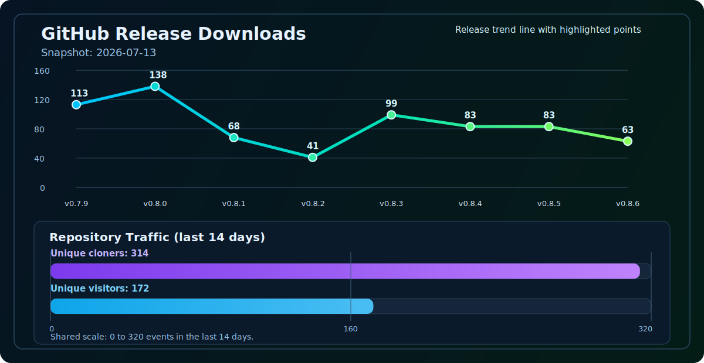
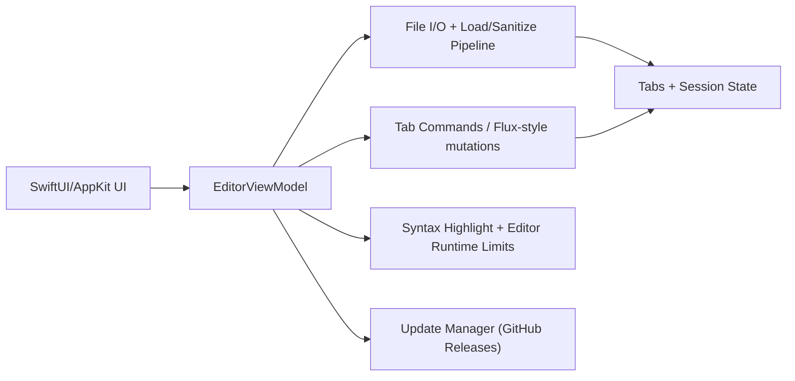
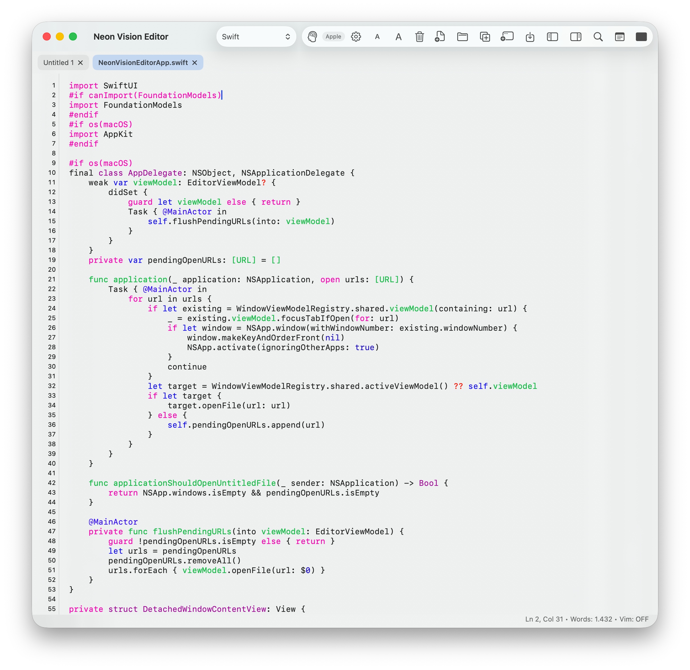
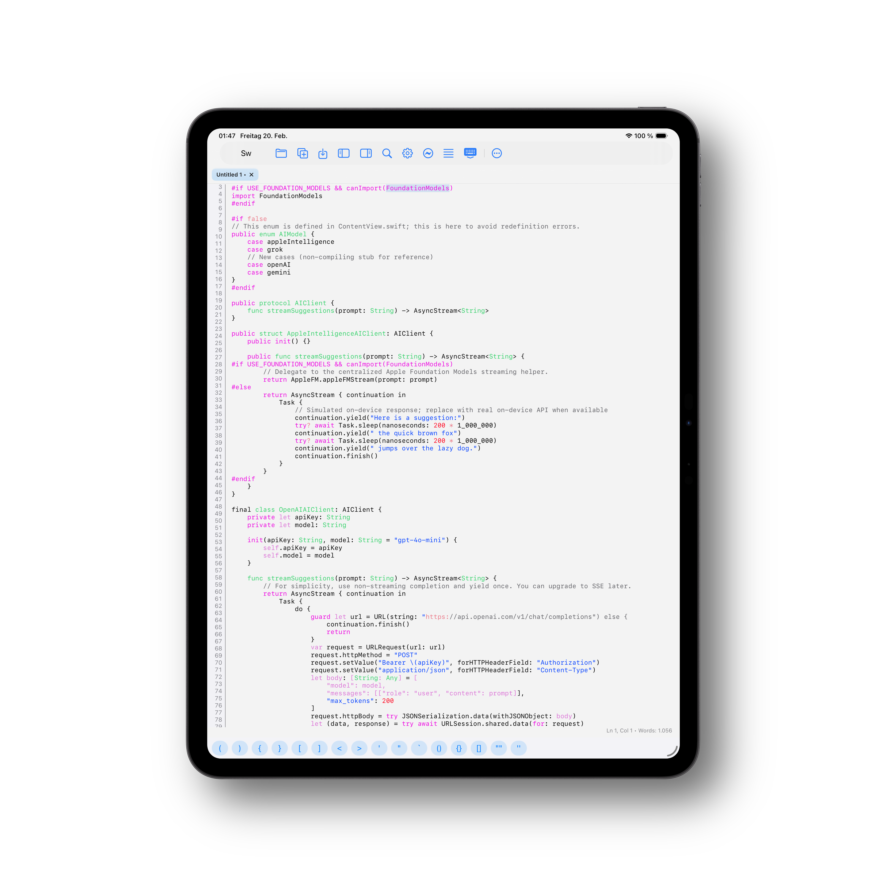
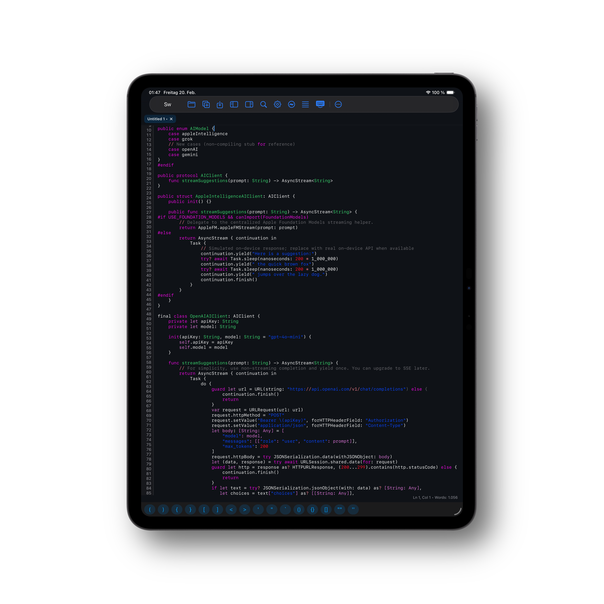
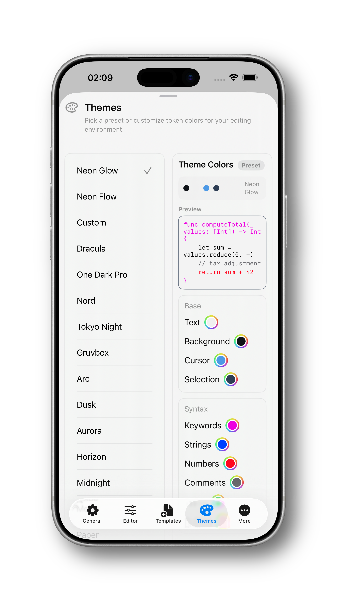
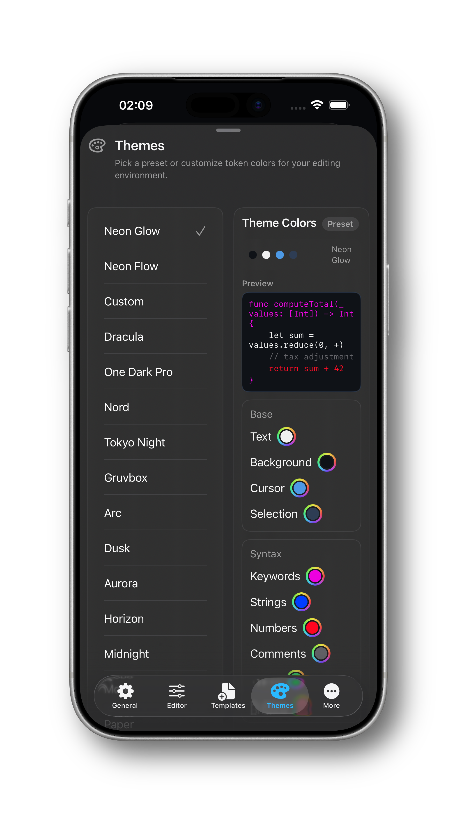
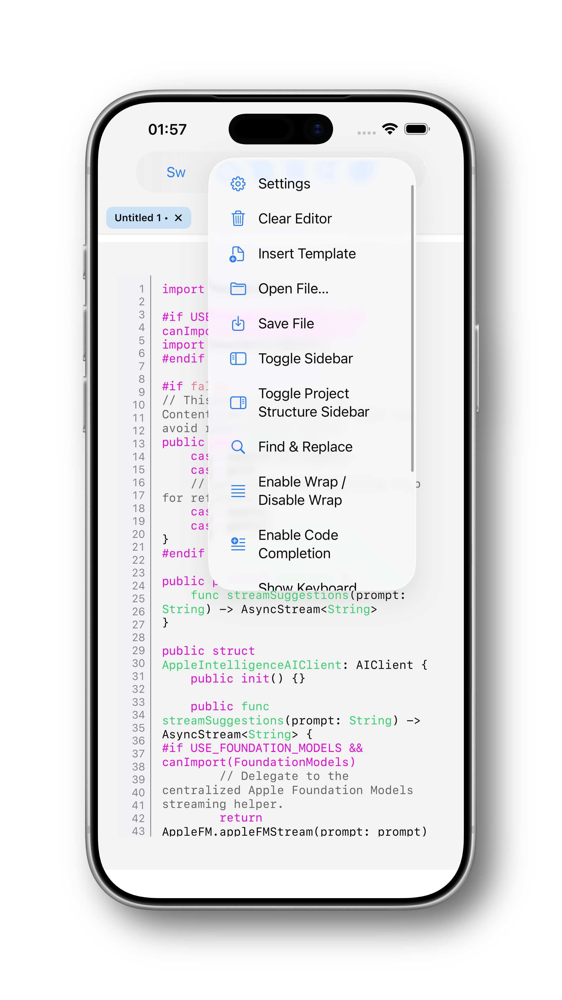
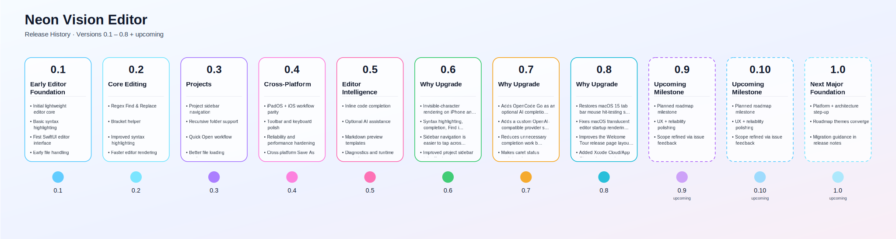

<h1 align="center">Neon Vision Editor</h1>

<p align="center">
  <a href="https://github.com/h3pdesign/Neon-Vision-Editor/releases"></a>
  <a href="https://github.com/h3pdesign/Neon-Vision-Editor/blob/main/LICENSE"></a>
  
  <a href="https://apps.apple.com/de/app/neon-vision-editor/id6758950965"></a>
  <a href="https://testflight.apple.com/join/YWB2fGAP"></a>
</p>

<p align="center">
  <a href="https://github.com/h3pdesign/Neon-Vision-Editor/actions/workflows/release-notarized.yml"></a>
  <a href="https://github.com/h3pdesign/Neon-Vision-Editor/actions/workflows/codeql.yml"></a>
  <a href="https://github.com/h3pdesign/homebrew-tap/actions/workflows/update-cask.yml"></a>
</p>

<p align="center">
  
</p>

<h4 align="center">
  A lightweight, modern editor focused on speed, readability, and automatic syntax highlighting.
</h4>

<p align="center">
  Minimal by design: quick edits, fast file access, no IDE bloat.
</p>

<p align="center">
  h3p apps is a focused portal for product docs, setup guides, and release workflows: <a href="https://apps-h3p.com"> >h3p apps</a>
</p>

<p align="center">
  Release Download: <a href="https://github.com/h3pdesign/Neon-Vision-Editor/releases">GitHub Releases</a>
</p>


> Status: **active release**  
> Latest release: **v0.5.2**
> Platform target: **macOS 26 (Tahoe)** compatible with **macOS Sequoia**
> Apple Silicon: tested / Intel: not tested
> Last updated (README): **2026-03-09** for release line **v0.5.2**

## Release Channels

<div align="center">
  <table>
    <thead>
      <tr>
        <th>Channel</th>
        <th>Best for</th>
        <th>Delivery</th>
      </tr>
    </thead>
    <tbody>
      <tr>
        <td><strong>Stable</strong></td>
        <td>Direct notarized builds and fastest stable updates</td>
        <td><a href="https://github.com/h3pdesign/Neon-Vision-Editor/releases">GitHub Releases</a></td>
      </tr>
      <tr>
        <td><strong>Store</strong></td>
        <td>Apple-managed install/update flow</td>
        <td><a href="https://apps.apple.com/de/app/neon-vision-editor/id6758950965">App Store</a></td>
      </tr>
      <tr>
        <td><strong>Beta</strong></td>
        <td>Early testing of upcoming changes</td>
        <td><a href="https://testflight.apple.com/join/YWB2fGAP">TestFlight</a></td>
      </tr>
    </tbody>
  </table>
</div>

## Download Metrics

<p align="center">
  
  
</p>

<p align="center"><strong>Release Download + Clone Trend</strong></p>

<p align="center">
  
</p>

<p align="center"><em>Styled line chart shows per-release totals plus a scaled 14-day git clone volume bar.</em></p>
<p align="center">Git clones (last 14 days): <strong>2220</strong>.</p>
<p align="center">Snapshot total downloads: <strong>591</strong> across releases.</p>

## Project Docs

- Release history: [`CHANGELOG.md`](CHANGELOG.md)
- Contributing guide: [`CONTRIBUTING.md`](CONTRIBUTING.md)
- Privacy: [`PRIVACY.md`](PRIVACY.md)
- Security policy: [`SECURITY.md`](SECURITY.md)
- Release checklists: [`release/`](release/) — TestFlight & App Store preflight docs

## What's New Since v0.5.1

- Added `Close All Tabs` actions across macOS, iOS, and iPadOS with a confirmation safeguard.
- Added project-sidebar quick actions (`Expand All` / `Collapse All`) and a default-on `Show Supported Files Only` filter.
- Added safer unsupported-file handling for sidebar/open/import flows with clear user alerts instead of crash paths.
- Added `.svg` file support with XML language mapping and syntax-highlighting path reuse.

## Who Is This For?

- Quick note takers who want a fast native editor without IDE overhead.
- Markdown-focused writers who need clean editing and quick preview on Apple devices.
- Developers editing scripts/config files who want syntax highlighting and fast file navigation.

## Why This Instead of a Full IDE?

- Faster startup and lower UI overhead for quick edits.
- Focused surface: editor-first workflow without project-system bloat.
- Native Apple-platform behavior across macOS, iOS, and iPadOS.

## Download

Prebuilt binaries are available on [GitHub Releases](https://github.com/h3pdesign/Neon-Vision-Editor/releases).

### GitHub Releases (Stable)

Best for direct notarized builds and fastest access to new stable versions.

- Download: [GitHub Releases](https://github.com/h3pdesign/Neon-Vision-Editor/releases)
- Latest release: **v0.5.2**
- Channel: **Stable**
- Architecture: Apple Silicon (Intel not tested)

### App Store

Best for users who prefer Apple-managed installs and updates.

- Download: [Neon Vision Editor on the App Store](https://apps.apple.com/de/app/neon-vision-editor/id6758950965)
- Channel: **Store**

### TestFlight (Beta)

Best for testing upcoming changes before they land in the stable channel.

- Join beta: [TestFlight Invite](https://testflight.apple.com/join/YWB2fGAP)
- Channel: **Beta**

## Getting Started (30 Seconds)

1. Install using `curl` or Homebrew (below), or download the latest `.zip`/`.dmg` from [Releases](https://github.com/h3pdesign/Neon-Vision-Editor/releases).
2. Move `Neon Vision Editor.app` to `/Applications`.
3. Launch the app.
4. Open a file with `Cmd+O`.
5. Use `Cmd+P` for Quick Open and `Cmd+F` for Find & Replace.
6. Toggle Vim mode with `Cmd+Shift+V` if needed.

## Install

### Quick install (curl)

Install the latest release directly:

```bash
curl -fsSL https://raw.githubusercontent.com/h3pdesign/Neon-Vision-Editor/main/scripts/install.sh | sh
```

Install without admin password prompts (user-local app folder):

```bash
curl -fsSL https://raw.githubusercontent.com/h3pdesign/Neon-Vision-Editor/main/scripts/install.sh | sh -s -- --appdir "$HOME/Applications"
```

### Homebrew

```bash
brew tap h3pdesign/tap
brew install --cask neon-vision-editor
```

Tap repository: [h3pdesign/homebrew-tap](https://github.com/h3pdesign/homebrew-tap)

If Homebrew asks for an admin password, it is usually because casks install into `/Applications`.
Use this to avoid that:

```bash
brew install --cask --appdir="$HOME/Applications" neon-vision-editor
```

### Gatekeeper (macOS 26 Tahoe)

If macOS blocks first launch:

1. Open **System Settings**.
2. Go to **Privacy & Security**.
3. In **Security**, find the blocked app message.
4. Click **Open Anyway**.
5. Confirm the dialog.

## Features

Neon Vision Editor keeps the surface minimal, but covers the workflows used most often while writing, coding, and reviewing files.

| Area | Highlights | macOS | iOS | iPadOS |
|---|---|---|---|---|
| Core Experience | Fast loading for regular and large text files; tabbed editing; broad syntax highlighting; native Swift/AppKit feel; multi-window workflows | Full | Full | Full |
| Editing & Productivity | Inline code completion (Tab accept); Regex Find/Replace (incl. Replace All); optional Vim mode; one-click language templates; curated built-in themes | Full | Full | Full |
| Markdown | Native Markdown preview templates (Default, Docs, Article, Compact); improved toolbar access to preview workflows; iPhone bottom-sheet preview with resizable detents | Full | Full | Full |
| Projects & Files | Project sidebar + Quick Open (`Cmd+P`); recursive folder tree; last-session project restore; cross-platform `Save As…`; direct handling for `.plist` / `.sh` / text files; SVG support (XML mode); unsupported-file safety with user alerts | Full | Full | Full |
| Settings & Support | Grouped settings with improved localization and tab structure; optional StoreKit 2 support purchase flow | Full | Full | Full |
| Architecture & Reliability | Flux/command-pattern command flow; Swift concurrency hardening; macOS AI Activity Log diagnostics; privacy-first/no telemetry | Full | Partial | Partial |

Feature checklist (explicit):

- Vim support (optional normal/insert workflow).
- Regex Find/Replace with Replace All.
- Inline code completion with Tab-to-accept.
- Native Markdown preview templates (macOS + iOS + iPadOS).
- iPhone Markdown preview bottom sheet with resizable detents.
- Quick Open (`Cmd+P`) and project sidebar navigation.
- Recursive project tree rendering for nested folders.
- Project sidebar quick actions: expand all / collapse all.
- Project sidebar filter: show supported files only (default enabled).
- Cross-platform `Save As…` support.
- Close All Tabs action with confirmation dialog.
- Unsupported file open/import safety (shows alert, avoids crash paths).
- SVG (`.svg`) file support with XML syntax mode.
- Bracket helper on all platforms (macOS toolbar helper, iOS/iPad keyboard bar).
- Starter templates for common languages.
- Built-in theme collection (Dracula, One Dark Pro, Nord, Tokyo Night, Gruvbox, Neon Glow).
- Session restore including previously opened project folder.
- Optional Support purchase flow in Settings (StoreKit 2).
- AI Activity Log diagnostics window on macOS.

## Architecture At A Glance



## Platform Matrix

Availability legend: `Full` = complete support, `Partial` = available with platform constraints, `No` = currently unavailable.

| Capability | macOS | iOS | iPadOS | Notes |
|---|---|---|---|---|
| Fast text editing + syntax highlighting | Full | Full | Full | Optimized for regular and large files. |
| Markdown preview templates | Full | Full | Full | Presets: Default, Docs, Article, Compact; iPhone uses bottom-sheet preview. |
| Project sidebar | Full | Full | Full | Folder tree + nested structure rendering. |
| Supported-files filter in project sidebar | Full | Full | Full | Toggle to show only supported files (default on). |
| Unsupported-file safety alerts | Full | Full | Full | Open/import unsupported files is blocked with user alert (no crash). |
| SVG file support (`.svg`) | Full | Full | Full | Opened as XML syntax-highlighted text. |
| Close All Tabs with confirmation | Full | Full | Full | Confirmation guard before bulk close action. |
| Quick Open (`Cmd+P`) | Full | Partial | Full | iOS requires hardware keyboard for shortcut use. |
| Bracket helper | Full | Full | Full | macOS: toolbar helper, iOS/iPadOS: keyboard snippet bar. |
| Settings tabs + grouped cards | Full | Full | Full | Localized UI with grouped preference cards. |

## Trust & Reliability Signals

- Notarized release pipeline: [release-notarized.yml](https://github.com/h3pdesign/Neon-Vision-Editor/actions/workflows/release-notarized.yml)
- Latest successful notarized run: [main + success](https://github.com/h3pdesign/Neon-Vision-Editor/actions/workflows/release-notarized.yml?query=branch%3Amain+is%3Asuccess)
- Pre-release verification gate: [pre-release-ci.yml](https://github.com/h3pdesign/Neon-Vision-Editor/actions/workflows/pre-release-ci.yml)
- Latest successful pre-release run: [main + success](https://github.com/h3pdesign/Neon-Vision-Editor/actions/workflows/pre-release-ci.yml?query=branch%3Amain+is%3Asuccess)
- Security scanning: [CodeQL workflow](https://github.com/h3pdesign/Neon-Vision-Editor/actions/workflows/codeql.yml)
- Latest successful CodeQL run: [main + success](https://github.com/h3pdesign/Neon-Vision-Editor/actions/workflows/codeql.yml?query=branch%3Amain+is%3Asuccess)
- Homebrew cask sync workflow: [update-cask.yml](https://github.com/h3pdesign/Neon-Vision-Editor/actions/workflows/update-cask.yml)
- Latest successful Homebrew sync run: [homebrew-tap + success](https://github.com/h3pdesign/homebrew-tap/actions/workflows/update-cask.yml?query=is%3Asuccess)

## Platform Gallery

- [macOS](#macos)
- [iPad](#ipad)
- [iPhone](#iphone)
- Source image index for docs: [`docs/images/README.md`](docs/images/README.md)
- App Store gallery: [Neon Vision Editor on App Store](https://apps.apple.com/de/app/neon-vision-editor/id6758950965)
- Latest release assets: [GitHub Releases](https://github.com/h3pdesign/Neon-Vision-Editor/releases)

### macOS

<p align="center">
  <a href="NeonVisionEditorApp.png">
    
  </a><br>
  <sub>macOS main editor window</sub>
</p>

### iPad

<table align="center">
  <tr>
    <td align="center">
      <a href="docs/images/ipad-editor-light.png">
        
      </a><br>
      <sub>Light Mode</sub>
    </td>
    <td align="center">
      <a href="docs/images/ipad-editor-dark.png">
        
      </a><br>
      <sub>Dark Mode</sub>
    </td>
  </tr>
</table>

### iPhone

<table align="center">
  <tr>
    <td align="center">
      <a href="docs/images/iphone-themes-light.png">
        
      </a><br>
      <sub>Light Mode</sub>
    </td>
    <td align="center">
      <a href="docs/images/iphone-themes-dark.png">
        
      </a><br>
      <sub>Dark Mode</sub>
    </td>
  </tr>
  <tr>
    <td align="center" colspan="2">
      <a href="docs/images/iphone-menu.png">
        
      </a><br>
      <sub>Toolbar Menu Actions</sub>
    </td>
  </tr>
</table>

## Release Flow (0.1 to 0.5)

<p align="center">
  <picture>
    <source media="(prefers-color-scheme: dark)" srcset="docs/images/neon-vision-release-history-0.1-to-0.5.svg">
    <source media="(prefers-color-scheme: light)" srcset="docs/images/neon-vision-release-history-0.1-to-0.5-light.svg">
    
  </picture>
</p>

## Roadmap (Near Term)

- 0.5.2 milestone: updater diagnostics, large-file mode parity, CSV/TSV table mode, and performance presets. Tracking: [Milestone 0.5.2](https://github.com/h3pdesign/Neon-Vision-Editor/milestone/3), [#24](https://github.com/h3pdesign/Neon-Vision-Editor/issues/24), [#25](https://github.com/h3pdesign/Neon-Vision-Editor/issues/25), [#26](https://github.com/h3pdesign/Neon-Vision-Editor/issues/26), [#30](https://github.com/h3pdesign/Neon-Vision-Editor/issues/30)
- 0.5.3 milestone: indexed project search and Open Recent favorites. Tracking: [Milestone 0.5.3](https://github.com/h3pdesign/Neon-Vision-Editor/milestone/4), [#29](https://github.com/h3pdesign/Neon-Vision-Editor/issues/29), [#31](https://github.com/h3pdesign/Neon-Vision-Editor/issues/31)
- 0.5.4 milestone: iPad settings layout density and reduced scrolling. Tracking: [Milestone 0.5.4](https://github.com/h3pdesign/Neon-Vision-Editor/milestone/5), [#12](https://github.com/h3pdesign/Neon-Vision-Editor/issues/12)
- 0.5.5 milestone: iOS file-handler QA matrix and UI tests. Tracking: [Milestone 0.5.5](https://github.com/h3pdesign/Neon-Vision-Editor/milestone/6), [#23](https://github.com/h3pdesign/Neon-Vision-Editor/issues/23)
- 0.5.6/0.5.7 milestones: Safe Mode startup and incremental loading for huge files. Tracking: [#27](https://github.com/h3pdesign/Neon-Vision-Editor/issues/27), [#28](https://github.com/h3pdesign/Neon-Vision-Editor/issues/28)
- 0.6.0 milestone: native side-by-side diff view. Tracking: [Milestone 0.6.0](https://github.com/h3pdesign/Neon-Vision-Editor/milestone/11), [#33](https://github.com/h3pdesign/Neon-Vision-Editor/issues/33)

## Known Issues

- Open known issues (live filter): [label:known-issue](https://github.com/h3pdesign/Neon-Vision-Editor/issues?q=is%3Aissue%20is%3Aopen%20label%3Aknown-issue)

## Troubleshooting

1. App blocked on first launch: use Gatekeeper steps above in `Privacy & Security`.
2. Markdown preview not visible: ensure you are on macOS or iPadOS (not available on iPhone).
3. Shortcut not working on iOS: connect a hardware keyboard for shortcut-based flows like `Cmd+P`.
4. Sidebar/layout feels cramped on iPad: switch orientation or close side panels before preview.
5. Settings feel off after updates: quit/relaunch app and verify current release version in Settings.

## Configuration

- Theme and appearance: `Settings > Designs`
- Editor behavior (font, line height, wrapping, snippets): `Settings > Editor`
- Startup/session behavior: `Settings > Allgemein/General`
- Support and purchase options: `Settings > Mehr/More` (platform-dependent)

## FAQ

- **Does Neon Vision Editor support Intel Macs?**  
  Intel is currently not fully validated.
- **Can I use it offline?**  
  Yes for core editing; network is only needed for optional external services (for example selected AI providers).
- **Do I need AI enabled to use the editor?**  
  No. Core editing, navigation, and preview features work without AI.
- **Where are tokens stored?**  
  In Keychain via `SecureTokenStore`, not in `UserDefaults`.

## Keyboard Shortcuts

All shortcuts use `Cmd` (`⌘`). iPad/iOS require a hardware keyboard.

### File

| Shortcut | Action | Platforms |
|---|---|---|
| `Cmd+N` | New Window | macOS |
| `Cmd+T` | New Tab | All |
| `Cmd+O` | Open File | All |
| `Cmd+Shift+O` | Open Folder | macOS |
| `Cmd+S` | Save | All |
| `Cmd+Shift+S` | Save As… | All |
| `Cmd+W` | Close Tab | macOS |

### Edit

| Shortcut | Action | Platforms |
|---|---|---|
| `Cmd+X` | Cut | All |
| `Cmd+C` | Copy | All |
| `Cmd+V` | Paste | All |
| `Cmd+A` | Select All | All |
| `Cmd+Z` | Undo | All |
| `Cmd+Shift+Z` | Redo | All |
| `Cmd+D` | Add Next Match | macOS |

### View

| Shortcut | Action | Platforms |
|---|---|---|
| `Cmd+Option+S` | Toggle Sidebar | All |
| `Cmd+Shift+D` | Brain Dump Mode | macOS |

### Find

| Shortcut | Action | Platforms |
|---|---|---|
| `Cmd+F` | Find & Replace | All |
| `Cmd+G` | Find Next | macOS |
| `Cmd+Shift+F` | Find in Files | macOS |

### Editor

| Shortcut | Action | Platforms |
|---|---|---|
| `Cmd+P` | Quick Open | macOS |
| `Cmd+D` | Add next match | macOS |
| `Cmd+Shift+V` | Toggle Vim Mode | macOS |

### Tools

| Shortcut | Action | Platforms |
|---|---|---|
| `Cmd+Shift+G` | Suggest Code | macOS |

### Diag

| Shortcut | Action | Platforms |
|---|---|---|
| `Cmd+Shift+L` | AI Activity Log | macOS |
| `Cmd+Shift+U` | Inspect Whitespace at Caret | macOS |

## Changelog

### v0.5.2 (summary)

- Added editor performance presets in Settings (`Balanced`, `Large Files`, `Battery`) with shared runtime mapping.
- Added configurable project navigator placement (`Left`/`Right`) for project-structure sidebar layout.
- Added richer updater diagnostics details in Settings: staged update summary, last install-attempt summary, and recent sanitized log snippet.
- Added CSV/TSV table mode with a `Table`/`Text` switch, lazy row rendering, and background parsing for larger datasets.
- Added an in-app `Editor Help` sheet that lists core editor actions and keyboard shortcuts.

### v0.5.1 (summary)

- Added bulk `Close All Tabs` actions to toolbar surfaces (macOS, iOS, iPadOS), including a confirmation step before closing.
- Added project-structure quick actions to expand all folders or collapse all folders in one step.
- Added six vivid neon syntax themes with distinct color profiles: `Neon Voltage`, `Laserwave`, `Cyber Lime`, `Plasma Storm`, `Inferno Neon`, and `Ultraviolet Flux`.
- Added a lock-safe cross-platform build matrix helper script (`scripts/ci/build_platform_matrix.sh`) to run macOS + iOS Simulator + iPad Simulator builds sequentially.
- Added iPhone Markdown preview as a bottom sheet with toolbar toggle and resizable detents for Apple-guideline-compliant height control.

### v0.5.0 (summary)

- Added updater staging hardening with retry/fallback behavior and staged-bundle integrity checks.
- Added explicit accessibility labels/hints for key toolbar actions and updater log/progress controls.
- Added a 0.5.0 quality roadmap milestone with focused issues for updater reliability, accessibility, and release gating.
- Improved CSV handling by enabling fast syntax profile earlier and for long-line CSV files to reduce freeze risk.
- Improved settings-window presentation on macOS by enforcing hidden title text in the titlebar.

Full release history: [`CHANGELOG.md`](CHANGELOG.md)

## Known Limitations

- Intel Macs are not fully validated.
- Vim support is intentionally basic (not full Vim emulation).
- iOS/iPad editor functionality is still more limited than macOS.

## Privacy & Security

- Privacy policy: [`PRIVACY.md`](PRIVACY.md).
- API keys are stored in Keychain (`SecureTokenStore`), not `UserDefaults`.
- Network traffic uses HTTPS.
- No telemetry.
- External AI requests only occur when code completion is enabled and a provider is selected.
- Security policy and reporting details: [`SECURITY.md`](SECURITY.md).

## Release Integrity

- Tag: `v0.5.2`
- Tagged commit: `1c31306`
- Verify local tag target:

```bash
git rev-parse --verify v0.5.2
```

- Verify downloaded artifact checksum locally:

```bash
shasum -a 256 <downloaded-file>
```

## Release Policy

- `Stable`: tagged GitHub releases intended for daily use.
- `Beta`: TestFlight builds may include in-progress UX and platform polish.
- Cadence: fixes/polish can ship between minor tags, with summary notes mirrored in README and `CHANGELOG.md`.

## Requirements

- macOS 26 (Tahoe)
- Xcode compatible with macOS 26 toolchain
- Apple Silicon recommended

## Build from source

```bash
git clone https://github.com/h3pdesign/Neon-Vision-Editor.git
cd Neon-Vision-Editor
open "Neon Vision Editor.xcodeproj"
```

## Contributing Quickstart

Contributor guide: [`CONTRIBUTING.md`](CONTRIBUTING.md)

```bash
git clone https://github.com/h3pdesign/Neon-Vision-Editor.git
cd Neon-Vision-Editor
xcodebuild -project "Neon Vision Editor.xcodeproj" -scheme "Neon Vision Editor" -destination 'platform=macOS,name=My Mac' build
```

Lock-safe cross-platform verification (sequential macOS + iOS Simulator + iPad Simulator):

```bash
scripts/ci/build_platform_matrix.sh
```

## Support & Feedback

- Questions and ideas: [GitHub Discussions](https://github.com/h3pdesign/Neon-Vision-Editor/discussions)
- Known issues: [label:known-issue](https://github.com/h3pdesign/Neon-Vision-Editor/issues?q=is%3Aissue%20is%3Aopen%20label%3Aknown-issue)
- Feature requests: [label:enhancement](https://github.com/h3pdesign/Neon-Vision-Editor/issues?q=is%3Aissue%20is%3Aopen%20label%3Aenhancement)

## Git hooks

To auto-increment Xcode `CURRENT_PROJECT_VERSION` on every commit:

```bash
scripts/install_git_hooks.sh
```

## Support

If you want to support development:

- [Patreon](https://www.patreon.com/h3p)
- [My site h3p.me](https://h3p.me/home)

## License

Neon Vision Editor is licensed under the MIT License.
See [`LICENSE`](LICENSE).
